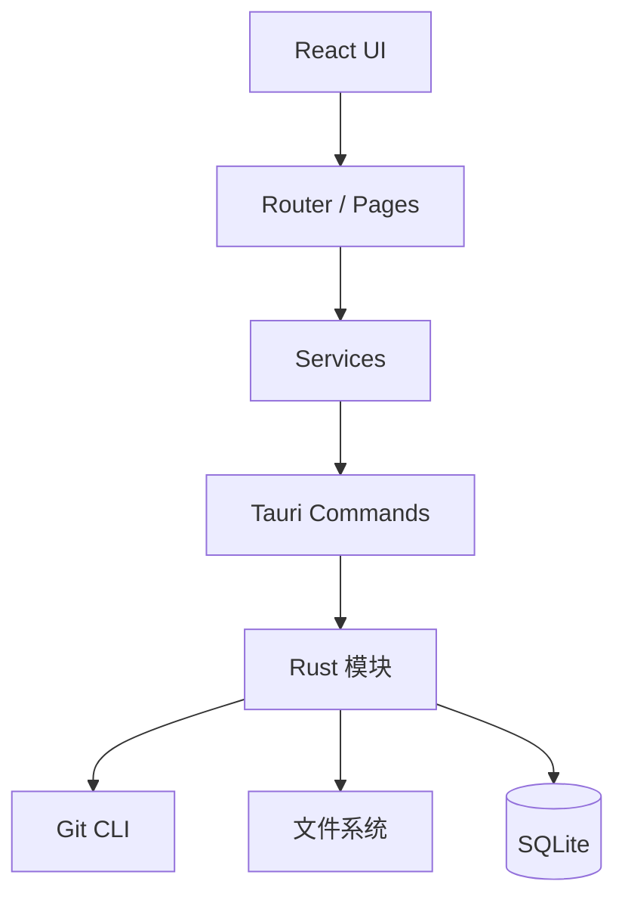

# JLGit

现代、轻量的跨平台 Git 桌面客户端。

基于 **Tauri 2 + React + TypeScript**，面向日常本地仓库工作流：多项目管理、状态、分支、提交、同步，以及后续的 Diff、历史图与 AI 辅助。

设计气质参考 GitHub Desktop、SourceGit、Linear 与 VS Code：**克制、清晰、快**。

> 项目宪法与 AI/贡献硬规则见 [AGENTS.md](AGENTS.md)。  
> 架构与开发细则见 [docs/](docs/architecture/overview.md)。

---

## 目标

- 管理多个本地 Git 仓库，打开即用
- 用可视化方式完成高频 Git 操作，减少上下文切换
- 保持安装包小、启动快、内存占用可控
- 架构可扩展至 Diff、Worktree、托管平台集成与 AI，而不推翻分层
- 文档与约定对人类与 AI Agent 同样友好，降低幻觉式改码

非目标：替代 IDE、成为 CI 控制台、在应用内重实现完整 Git 对象数据库。

---

## 截图

界面截图存放于 [`docs/assets/screenshots/`](docs/assets/screenshots/)，随功能版本更新：

| 文件名 | 内容 |
|--------|------|
| `dashboard.png` | 仪表盘 / 项目列表 |
| `repository.png` | 仓库工作区（Status / Commit） |
| `diff.png` | Diff 视图 |

当前为 **v0.1**（应用壳与文档），业务界面落地后补齐上述文件并在本表改为直接预览。

---

## 功能概览

| 领域 | 能力 | 状态 |
|------|------|------|
| 项目 | 导入 / 打开 / 最近 / 收藏 | Planned |
| 仓库 | Status、暂存、提交 | Planned |
| 分支 | 创建、切换、合并入口 | Planned |
| 远程 | Fetch / Pull / Push | Planned |
| Diff / 历史 | 文件 Diff、提交图 | Planned |
| 高级 | Stash、Tag、Rebase、Worktree | Planned |
| AI | Commit 文案、Diff 解释、Review | Planned |
| 应用壳 | 窗口、主题、插件预置 | In Progress |

完整矩阵见 [docs/product/feature-list.md](docs/product/feature-list.md)。

---

## 技术栈

| 层 | 技术 |
|----|------|
| Desktop | Tauri 2、Rust |
| Frontend | React 19、TypeScript、Vite |
| UI | Tailwind CSS 4、shadcn/ui、lucide-react |
| 状态 | Zustand |
| 路由 | React Router |
| 表单 | React Hook Form、Zod |
| 数据 | SQLite（`tauri-plugin-sql`）、Tauri Store |
| 其他 | i18next、Monaco（Diff/编辑场景）、TanStack Virtual |

---

## 环境要求

- Node.js 20+
- pnpm 9+
- Rust 稳定版（与 Tauri 2 兼容）
- 系统已安装 `git`，且在 `PATH` 中可用
- macOS / Windows / Linux（Tauri 官方支持的桌面目标）

---

## 安装与开发

```bash
# 克隆
git clone <repository-url> JLGit
cd JLGit

# 安装依赖
pnpm install

# 仅前端（浏览器调试 UI，无原生能力）
pnpm dev

# 桌面应用（推荐）
pnpm tauri dev
```

### 构建

```bash
# 前端生产构建
pnpm build

# 打包桌面安装包
pnpm tauri build
```

产物位置与平台差异以 Tauri 构建输出为准（通常在 `src-tauri/target/release/bundle/`）。

---

## 目录速览

```
JLGit/
├── AGENTS.md                 # 项目宪法（Agent / 贡献硬规则）
├── README.md
├── CONTRIBUTING.md
├── docs/                     # 架构 · 开发 · 产品 · API
├── src/                      # React 前端
├── src-tauri/                # Rust / Tauri
├── public/
└── package.json
```

前端目标结构与模块归属：[docs/development/project-structure.md](docs/development/project-structure.md)  
调用链说明：[docs/architecture/overview.md](docs/architecture/overview.md)

---

## 架构（简图）



原则：**UI → Service → Command → Rust → Git**。UI 不直接执行 Git，不拼接 shell。

---

## 路线图

| 版本 | 主题 |
|------|------|
| v0.1 | 应用壳、文档、项目模型 |
| v0.2 | Status / Stage / Commit |
| v0.3 | Branch / Fetch / Pull / Push |
| v0.4 | Diff Viewer |
| v0.5 | History / Graph / Tag / Stash |
| v0.6 | Merge / Rebase / Cherry-pick / Worktree |
| v0.7 | 设置完善、性能与安全加固 |
| v0.8 | 托管平台集成（GitHub 等）预留 |
| v0.9 | AI 辅助（Commit / Diff Explain / Review） |
| v1.0 | 稳定 API、发布通道、文档冻结 |

细节：[docs/product/roadmap.md](docs/product/roadmap.md)

---

## 文档地图

| 想了解… | 去读 |
|---------|------|
| 硬性约定 | [AGENTS.md](AGENTS.md) |
| 如何贡献 | [CONTRIBUTING.md](CONTRIBUTING.md) |
| 分层与数据流 | [docs/architecture/overview.md](docs/architecture/overview.md) |
| Command 契约 | [docs/architecture/command.md](docs/architecture/command.md) |
| UI / 主题 | [docs/development/ui-guidelines.md](docs/development/ui-guidelines.md) |
| 功能状态 | [docs/product/feature-list.md](docs/product/feature-list.md) |
| 变更记录 | [CHANGELOG.md](CHANGELOG.md) |

---

## 贡献

欢迎 Issue 与 PR。请先阅读 [CONTRIBUTING.md](CONTRIBUTING.md) 与 [CODE_OF_CONDUCT.md](CODE_OF_CONDUCT.md)。

提交信息使用 Conventional Commits，例如：`feat(git): 支持拉取当前分支`。

---

## License

[MIT](LICENSE) © JLGit Contributors
