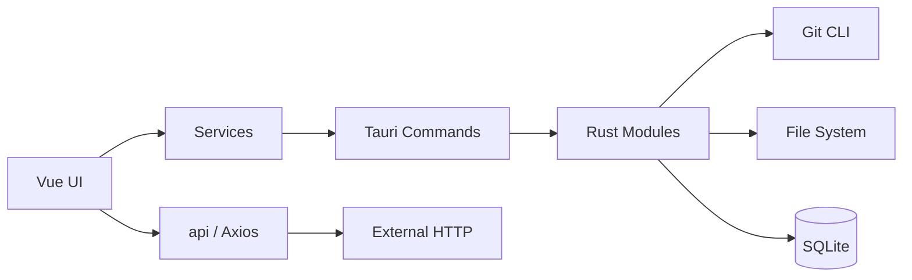

<p align="center">
  
</p>

<h1 align="center">鲸灵Git</h1>

<p align="center">
  <strong>现代、轻量的跨平台 Git 桌面客户端</strong>
</p>

<p align="center">
  多仓管理 · 变更与提交 · 分支与同步 · Diff / 历史 · 冲突解决 · 可选 AI 助手
</p>

<p align="center">
  <a href="https://github.com/DonutGeek/jl-git-releases/releases/latest"></a>
  &nbsp;
  
  &nbsp;
  
  &nbsp;
  
  &nbsp;
  
</p>

<p align="center">
  <a href="https://github.com/DonutGeek/jl-git-releases/releases/latest"><strong>下载最新版</strong></a>
  &nbsp;·&nbsp;
  <a href="#核心能力">核心能力</a>
  &nbsp;·&nbsp;
  <a href="#本地开发">本地开发</a>
  &nbsp;·&nbsp;
  <a href="#文档">文档</a>
  &nbsp;·&nbsp;
  <a href="#参与贡献">参与贡献</a>
</p>

---

鲸灵Git（仓库名 **JLGit**）基于 **Tauri 2 + Vue 3 + TypeScript**，专注开发者日常的本地 Git 工作流：管理多个仓库、看清改动、提交与同步，并在需要时获得 AI 辅助。

产品追求 **克制、清晰、快**，体验参考 GitHub Desktop、SourceGit、Linear 与 VS Code。它不会替代 IDE，也不试图成为 CI/CD 或全能 DevOps 控制台。

> 当前仓库是鲸灵Git的**源码与开发仓库**。安装包、签名产物和线上升级清单由公开的 [jl-git-releases](https://github.com/DonutGeek/jl-git-releases) 仓库托管。

## 下载与安装

前往 [**Releases**](https://github.com/DonutGeek/jl-git-releases/releases/latest)，选择与你的系统匹配的安装包：

| 平台 | 支持架构 | 安装包 |
|------|----------|--------|
| macOS | Apple Silicon（aarch64） | `.dmg` |
| Windows | x64 | NSIS 安装包（`.exe`） |
| Linux | x64 | AppImage |

安装或运行前请确认：

- 系统已安装 **Git**，并且可在 `PATH` 中调用
- Linux 官方参考环境为 Ubuntu 22.04 / 24.04 + GNOME；其他发行版尽力支持
- 正式安装包支持应用内检查、下载和安装签名更新

源码仓的 `main` 分支持续迭代，可能领先于公开稳定版。实际安装能力请以 [Releases](https://github.com/DonutGeek/jl-git-releases/releases) 说明和应用内版本号为准。

## 核心能力

| 领域 | 当前能力 |
|------|----------|
| 项目管理 | 导入本地仓库、克隆远程仓库、最近打开、多仓标签切换、仓库分组与管理 |
| 工作区 | 目录树浏览、文件预览、文件操作，以及使用系统文件管理器、编辑器或终端打开 |
| 变更与提交 | 未暂存 / 已暂存列表、Stage / Unstage、全部暂存、提交、修改 HEAD 提交信息 |
| Diff | 工作区与暂存区 Diff、Monaco 对比视图、大文件截断、二进制文件提示 |
| 分支 | 本地 / 远程分支浏览、创建、切换、历史查看与分支比较 |
| 历史与标签 | 分页提交历史、提交图、文件历史、轻量 / 附注标签的创建与删除 |
| 远程同步 | Fetch、Pull、Push，以及提交后推送 |
| 合并与冲突 | Merge、冲突检测、整文件 / 逐块解决和完成合并引导 |
| 设置与数据 | 浅色 / 深色 / 跟随系统、中英文、多套主题、Git 身份、SSH 密钥、数据备份与恢复 |
| 鲸灵 AI | 可选 DeepSeek：提交文案、分支命名、单仓 / 多仓对话；用户始终确认关键 Git 操作 |

功能仍在持续演进。各能力的完成度、限制与后续计划以 [功能清单](docs/product/feature-list.md) 和 [路线图](docs/product/roadmap.md) 为准。

## 鲸灵 AI

鲸灵是内置的 Git 工作流助手，分为两个使用上下文：

- **单仓鲸灵**：围绕当前仓库理解改动、生成提交文案、辅助命名分支并进行项目问答
- **多仓鲸灵**：从已登记仓库中提供跨项目的只读画像与对话能力

AI 功能是可选的，需要用户自行配置 DeepSeek API Key。生成内容只作为建议；提交等关键 Git 操作仍由用户确认。使用 AI 时，完成请求所需的上下文会发送给对应模型服务，请勿主动提交密钥、私钥或其他敏感内容。

详细说明见 [AI 产品文档](docs/product/ai.md)。

## 本地开发

### 环境要求

- Node.js 20+
- pnpm 9+
- Rust stable（兼容 Tauri 2）
- Git

### 启动项目

```bash
git clone https://github.com/DonutGeek/jl-git.git
cd jl-git
pnpm install

# 桌面应用，包含完整 Tauri / Git / 文件系统能力
pnpm tauri dev
```

仅调试前端界面时可以运行：

```bash
pnpm dev
```

浏览器模式不提供 Tauri 原生能力。开发版使用独立应用标识 `com.jingling.jlgit.dev`，数据目录与正式安装版隔离。

### 本地环境配置

Vite 按 mode 加载环境文件（后者覆盖前者）：

| 文件 | 何时加载 | 是否提交 |
|------|----------|----------|
| [`.env.example`](.env.example) | 模板（复制为 `.env` / `.env.local`） | 是 |
| [`.env.development`](.env.development) | `pnpm dev`、`pnpm tauri dev` | 是 |
| [`.env.production`](.env.production) | `pnpm build`、`pnpm tauri build` | 是 |
| `.env` / `.env.local` / `.env.*.local` | 本机覆盖 | 否 |

当前可配置的键：

- `VITE_APP_NAME_ZH` / `VITE_APP_NAME_EN` — 应用中英文展示名（开发英文名为 `JLGit Dev`）
- `VITE_API_BASE_URL` — 外部 HTTP 网关前缀（可选；空则 `src/api` 使用完整 URL）

`VITE_*` 会进入前端构建产物，只允许非敏感配置；API Key、token、密码等仍必须使用应用安全存储或系统环境变量。桌面端 `productName` / bundle id 由 `src-tauri/tauri.conf*.json` 控制，与上述前端展示名相互独立。

### 检查与构建

```bash
# TypeScript 检查与前端生产构建
pnpm build

# 构建当前平台的桌面安装包
pnpm tauri build
```

桌面产物通常位于 `src-tauri/target/release/bundle/`，具体目录以 Tauri 构建输出为准。

## 技术栈

| 层 | 技术 |
|----|------|
| Desktop | Tauri 2、Rust |
| Frontend | Vue 3、TypeScript、Vite |
| UI | Tailwind CSS 4、antdv-next、`@/components/Icon`（morphicons + lucide） |
| 状态与路由 | Pinia、Vue Router |
| 表单与校验 | antdv-next Form、Zod |
| HTTP | Axios（`src/api/` + `src/utils/http`） |
| 数据 | SQLite、Tauri Store |
| 编辑与列表 | Monaco Editor、TanStack Virtual（Vue） |
| 国际化 | vue-i18n |

## 架构



核心调用链是：

```text
Vue → View / Component
  ├─ Service → Tauri Command → Rust → Git CLI / FS / SQLite
  └─ api → Axios requestClient → 外部 HTTP
```

- UI 不直接执行 Git，也不拼接 shell
- 本地能力只经 Service，外部 HTTP 只经 `api/` + `requestClient`
- Tauri Command 是 Rust 侧唯一入口
- Git 与文件系统操作在 Rust 侧完成，路径和参数经过显式校验
- SQLite 保存应用业务数据，Git 对象仍由 Git 管理

完整分层说明见 [架构总览](docs/architecture/overview.md)。

## 目录结构

```text
JLGit/
├── src/                 # Vue 前端
├── src-tauri/           # Rust / Tauri
├── scripts/             # 开发与发版脚本
├── docs/                # 架构、开发、产品与 API 文档
├── AGENTS.md            # 项目宪法与硬性约束
└── package.json
```

更细的目录归属规则见 [项目结构](docs/development/project-structure.md)。

## 文档

| 想了解 | 文档 |
|--------|------|
| 项目原则与硬性约束 | [AGENTS.md](AGENTS.md) |
| 产品功能状态 | [docs/product/feature-list.md](docs/product/feature-list.md) |
| 产品路线图 | [docs/product/roadmap.md](docs/product/roadmap.md) |
| 前后端分层 | [docs/architecture/overview.md](docs/architecture/overview.md) |
| Git 执行模型 | [docs/architecture/git.md](docs/architecture/git.md) |
| Command 契约 | [docs/architecture/command.md](docs/architecture/command.md) |
| UI 与主题规范 | [docs/development/ui-guidelines.md](docs/development/ui-guidelines.md) |
| 测试与质量标准 | [docs/development/quality.md](docs/development/quality.md) |
| 发布与线上升级 | [docs/product/releases.md](docs/product/releases.md) |

## 参与贡献

欢迎提交 [Issue](https://github.com/DonutGeek/jl-git/issues) 和 Pull Request。开始前请阅读 [AGENTS.md](AGENTS.md)。

提交信息遵循 Conventional Commits，例如：

```text
feat(project): 支持克隆远程仓库
fix(diff): 修复二进制文件误判为文本
docs(readme): 更新安装与功能说明
```

