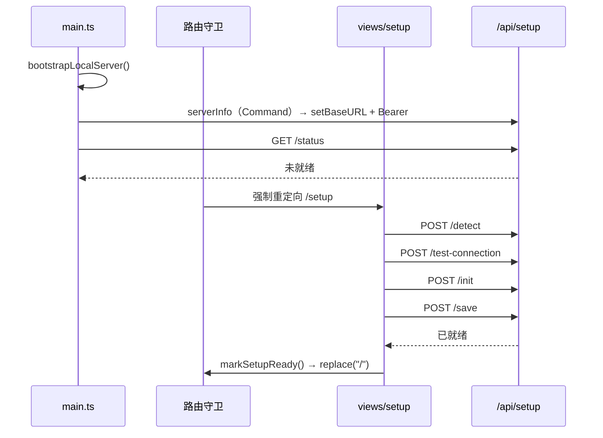

# Setup API（首启配置向导）

> **相关文档：** [architecture/database](../architecture/database.md) · [architecture/command](../architecture/command.md) · [architecture/overview](../architecture/overview.md)

数据库不随包分发，首次启动需由用户提供 PostgreSQL 连接参数。本文是这组接口的契约。

前端封装：`src/api/setup.ts`；页面：`src/views/setup/`。

---

## 通道与信封

除 `serverInfo` 外全部走内嵌 Axum 服务（见 [ADR-3](../architecture/overview.md#adr-3本地后端用内嵌-axum-http-服务而非只用-tauri-command)）：

```
src/api/setup.ts → requestClient → http://127.0.0.1:<port>/api/setup/*
```

响应统一信封，成功时 `code = 0`：

```json
{ "code": 0, "message": "success", "data": { } }
```

失败时 HTTP 状态码与 `error.code` 同时给出，`requestClient` 会解出 `AppError` 抛给调用方：

```json
{
  "code": 400,
  "message": "无法连接 PostgreSQL",
  "data": null,
  "error": { "code": "DB_CONNECT_FAILED", "details": "role \"postgres\" does not exist" }
}
```

`details` 是 PostgreSQL 原文，向导必须展示它——只显示 `message` 用户无法定位问题。

鉴权：所有 `/api/*` 需要 `Authorization: Bearer <token>`，token 由 `serverInfo` 下发。

---

## `serverInfo`（Tauri Command）

引导阶段 `requestClient` 还没有 baseURL，因此这一个走 Command。

| | |
|--|--|
| **地址** | `serverInfo` → `server_info` |
| **输入** | `{}` |
| **输出** | `{ port: number; token: string; baseUrl: string }` |
| **错误** | `INTERNAL` |

---

## `GET /api/setup/status`

| | |
|--|--|
| **目的** | 判断数据库是否已配通；路由守卫据此决定是否强制进向导 |
| **输出** | `{ configured, connected, schemaReady, serverVersion?, config? }` |
| **说明** | `config` 为 `{ host, port, user, database }`，**不含口令**，用于向导回填 |

三个布尔全为 `true` 才算就绪：`configured` 表示落过盘，`connected` 表示连接池已建立，`schemaReady` 表示迁移跑完。

---

## `POST /api/setup/detect`

| | |
|--|--|
| **目的** | 探测本机环境，并下发连接表单的默认值 |
| **输入** | `{}` |
| **输出** | `{ portReachable, host, port, psqlPath?, psqlVersion?, suggestedUser, suggestedDatabase, downloadUrl }` |
| **错误** | `INTERNAL` |

探测失败**不阻断**流程：数据库可能在其他主机或端口，用户可在下一步手填。

默认值来自 Rust 侧 `DbConfig::default()`，前端不再硬编码第二份：

| 字段 | 默认值 | 理由 |
|------|--------|------|
| `host` / `port` | `127.0.0.1` / `5432` | PostgreSQL 默认监听 |
| `suggestedUser` | **本机登录用户名**（如 `jingling`），取不到时回退 `postgres` | Homebrew 与 Postgres.app 建库时把登录名作为超级用户角色，填 `postgres` 反而连不上 |
| `suggestedDatabase` | `jl_git` | 与项目其他库名风格一致（下划线分词） |

回填优先级：**已保存配置 > 探测建议 > 表单占位**。用户在表单里改过的值优先级最高，退回上一步不会被重置。

---

## `POST /api/setup/test-connection`

| | |
|--|--|
| **目的** | 用表单参数试连，不落盘、不建库 |
| **输入** | `{ host, port, user, password, database }` |
| **输出** | `{ ok, serverVersion?, databaseExists }` |
| **错误** | `VALIDATION`（参数不合法）· `DB_CONNECT_FAILED`（400，连不上或凭据错） |

`databaseExists = false` 不是错误：初始化步骤会创建它。

向导的「下一步」也会调用本接口，**连通才放行**——只做必填校验的话，错误凭据会一路带到初始化步骤才暴露。因为用户可能在上次成功测试之后又改了参数，每次点「下一步」都重连一遍，不复用上次结果。

> 角色名区分大小写：`Jingling` 与 `jingling` 是两个不同的角色。凭据错时 `details` 会带 PostgreSQL 原文，照它排查。

试连走的是维护库（`postgres`）而非目标库，这样目标库尚未创建时也能区分「凭据错」与「库还没建」。

---

## `POST /api/setup/init`

| | |
|--|--|
| **目的** | 按需建库并执行 `src-tauri/migrations/` 下的迁移 |
| **输入** | 同 `test-connection` |
| **输出** | `{ ok, databaseCreated, schemaReady }` |
| **错误** | `VALIDATION` · `DB_CONNECT_FAILED` · `DB_ERROR`（建库或迁移失败） |

幂等：库已存在则复用（`databaseCreated = false`），迁移由 `sqlx` 按 `_sqlx_migrations` 跳过已跑版本。已有数据不会被清空。

库名限制 `^[A-Za-z_][A-Za-z0-9_]*$`，因为它要拼进 `CREATE DATABASE`，不能走参数占位。

---

## `POST /api/setup/save`

| | |
|--|--|
| **目的** | 落盘连接配置并把连接池装进 `AppState`，此后业务接口才放行 |
| **输入** | 同 `test-connection` |
| **输出** | 与 `status` 相同的结构 |
| **错误** | `VALIDATION` · `DB_CONNECT_FAILED` · `INTERNAL`（写 Store 失败） |

配置写入应用数据目录下的 Tauri Store 文件 `db-config.json`。**口令以明文存于该文件**，与 `ai-secrets.json` 等同级，属于本机用户目录范围内的信任边界；不写日志、不进任何导出。

下次启动由 `services::setup::restore_saved_pool` 自动读取并重连，用户无需再过向导。

---

## 未配通时的其他接口

除 `/api/health` 与 `/api/setup/*` 外，业务接口在连接池缺失时统一返回：

| | |
|--|--|
| **HTTP** | 503 Service Unavailable |
| **`error.code`** | `DB_NOT_CONFIGURED` |

由 `state::Db` extractor 兜住，业务 Handler 不再逐个判空。

---

## 向导流程



守卫是双向的：未就绪时任何路由都跳 `/setup`，已就绪时 `/setup` 跳回 `/`。
