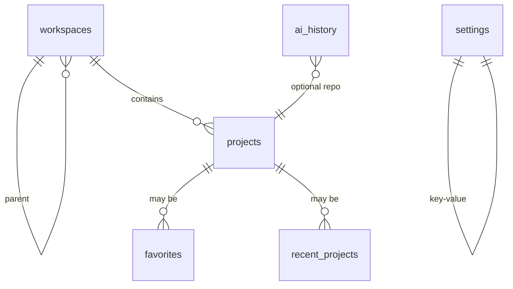

# 数据库设计

> **相关文档：** [overview](overview.md) · [tauri](tauri.md) · [state-management](../development/state-management.md) · [api/project](../api/project.md) · [api/settings](../api/settings.md)

JLGit 使用 SQLite（`tauri-plugin-sql`，库名 `sqlite:jlgit.db`）存储**应用数据**。Git 对象与引用仍由各仓库 `.git` 管理。

应用数据目录由 Tauri `identifier` 决定：

| 构建 | identifier | macOS 路径示例 |
|------|------------|----------------|
| `pnpm tauri build`（正式包） | `com.jingling.jlgit` | `~/Library/Application Support/com.jingling.jlgit/` |
| `pnpm tauri dev`（开发） | `com.jingling.jlgit.dev` | `~/Library/Application Support/com.jingling.jlgit.dev/` |

开发与正式包**不得**共用同一目录，避免测试数据进入安装包体验。轻量偏好另存于 Tauri Store 文件（如 `ai-secrets.json`、`git-accounts.json`），与 SQLite 同目录。

---

## 设计原则

1. 表结构服务产品功能，不镜像 Git 对象模型
2. 所有迁移可重复、有版本号
3. 路径以文本存储；打开时再校验磁盘状态
4. 可空字段必须有产品语义；避免「万能 JSON 大列」滥用（配置可用 JSON 文本列）

---

## ER 概览



---

## 表定义

### `workspaces`

逻辑工作区（一组项目的集合，便于多客户/多公司切换）。

| 列 | 类型 | 说明 |
|----|------|------|
| `id` | TEXT PK | UUID |
| `parent_id` | TEXT NULL | 父分组 ID；NULL 表示根分组 |
| `name` | TEXT NOT NULL | 显示名 |
| `sort_order` | INTEGER NOT NULL DEFAULT 0 | 排序 |
| `created_at` | TEXT NOT NULL | ISO-8601 |
| `updated_at` | TEXT NOT NULL | ISO-8601 |

### `projects`

本地 Git 仓库登记。

| 列 | 类型 | 说明 |
|----|------|------|
| `id` | TEXT PK | UUID |
| `workspace_id` | TEXT NULL | FK → workspaces.id |
| `name` | TEXT NOT NULL | 默认取文件夹名，可改 |
| `description` | TEXT NULL | 项目简介（可选；打开时可手填或 AI 生成） |
| `icon` | TEXT NOT NULL DEFAULT `folder-git-2` | 受控 Lucide 图标键；默认沿用当前仓库图标 |
| `path` | TEXT NOT NULL UNIQUE | 规范化绝对路径 |
| `last_opened_at` | TEXT NULL | 上次打开 |
| `pinned` | INTEGER NOT NULL DEFAULT 0 | 1=置顶 |
| `sort_order` | INTEGER NOT NULL DEFAULT 0 | 分组内排序 |
| `created_at` | TEXT NOT NULL | |
| `updated_at` | TEXT NOT NULL | |

索引：`path` UNIQUE；`last_opened_at`；`workspace_id`。

### `favorites`

| 列 | 类型 | 说明 |
|----|------|------|
| `project_id` | TEXT PK | FK → projects.id ON DELETE CASCADE |
| `sort_order` | INTEGER NOT NULL DEFAULT 0 | |
| `created_at` | TEXT NOT NULL | |

### `recent_projects`

| 列 | 类型 | 说明 |
|----|------|------|
| `project_id` | TEXT PK | FK → projects.id ON DELETE CASCADE |
| `opened_at` | TEXT NOT NULL | 最近一次 |
| `open_count` | INTEGER NOT NULL DEFAULT 1 | |

应用层限制最近 N 条（如 20），超出淘汰最旧。

### `settings`

| 列 | 类型 | 说明 |
|----|------|------|
| `key` | TEXT PK | 如 `theme.mode`、`git.executable` |
| `value` | TEXT NOT NULL | JSON 文本 |
| `updated_at` | TEXT NOT NULL | |

常见键（约定，非强制枚举封闭）：

| key | 语义 |
|-----|------|
| `theme.mode` | `light` \| `dark` \| `system` |
| `locale` | `zh-CN` \| `en` |
| `git.executable` | 自定义 git 路径或空 |
| `git.defaultBranch` | 展示用默认名提示 |
| `ui.sidebarWidth` | 数字 |
| `ai.provider` | 提供商 id |
| `ai.enabled` | boolean |

轻量、高频、与窗口强相关的项也可进 Tauri Store；**产品设置页展示的项以本表为准**，避免双写。若用 Store，文档中标明键名且不与 settings 键冲突。

### `ai_history`

| 列 | 类型 | 说明 |
|----|------|------|
| `id` | TEXT PK | UUID |
| `project_id` | TEXT NULL | FK，可空（全局对话） |
| `kind` | TEXT NOT NULL | `commit_message` \| `diff_explain` \| `review` \| `branch_name` \| `release_notes` |
| `input_summary` | TEXT NOT NULL | 脱敏摘要，非全量 diff |
| `output` | TEXT NOT NULL | 模型输出 |
| `model` | TEXT NULL | |
| `created_at` | TEXT NOT NULL | |

面向提交建议等短历史（预留）。**单仓 / 多仓鲸灵多轮对话**不走本表，见下方 `chat_*`。

不存 API Key；密钥走系统安全存储或环境变量（见 security / ai 文档）。

### `chat_conversations` / `chat_messages`（schema v4）

多轮对话持久化：单仓鲸灵按项目归属，多仓鲸灵全局、仅手动删除。设置「数据」可按 scope 清理或完整备份（见 `app_data_*`）。

| 表 | 列 | 说明 |
|----|----|------|
| `chat_conversations` | `id` TEXT PK | 会话 ID |
| | `scope` TEXT | `agent`（单仓）\| `agent_global`（多仓；旧 `jinglv` / `resume_helper` 在 schema v6 迁移） |
| | `project_id` TEXT NULL | 单仓鲸灵必填，FK → `projects(id)` **ON DELETE CASCADE**；多仓鲸灵必须为 NULL |
| | `title` / `pinned` / `sort_order` | 展示与排序 |
| | `created_at` / `updated_at` | ISO 时间 |
| `chat_messages` | `id` TEXT PK | 消息 ID |
| | `conversation_id` TEXT | FK → `chat_conversations(id)` ON DELETE CASCADE |
| | `role` / `content` | `user` \| `assistant` 与正文 |
| | `reasoning_content` / `reasoning_duration_ms` | 深度思考全文与耗时（可空） |
| | `mentions_json` | 分支 mention 等（可空 JSON） |
| | `created_at` / `sort_order` | 时间与会话内顺序 |

写入时机：消息完成 / 停止并保留片段 / 编辑截断 / 重命名 / 置顶 / 重排 / 删除；不写流式中间帧。

---

## 迁移策略

1. 维护 `schema_version`（可用 settings 键或独立 `schema_migrations` 表）
2. 启动时顺序执行未跑迁移
3. 迁移脚本只追加，不改已发布脚本内容
4. 破坏性变更在 roadmap 大版本说明

建议表：

```sql
CREATE TABLE schema_migrations (
  version INTEGER PRIMARY KEY,
  applied_at TEXT NOT NULL
);
```

---

## 访问路径

```
ProjectService / SettingsService / AiService
  → invoke("db_*" 或领域 command)
    → Rust db 模块
      → plugin-sql
```

前端不拼接任意 SQL。允许的只读查询应封装为 Command。

---

## 备份与隐私

- 数据库位于应用数据目录；备份即复制该文件
- `ai_history.input_summary` 避免写入密钥与完整源码机密；用户可一键清空
- 卸载策略：遵循 OS 应用数据惯例，文档中说明路径

---

## 决策：为何不用仅 Store

| | Store | SQLite（采用） |
|--|-------|----------------|
| 查询 | 弱 | 强（最近、工作区过滤） |
| 关系 | 无 | 有 FK |
| 迁移 | 手工 | 版本化 |
| 复杂度 | 低 | 中（可接受） |

Store 仅作补充，不是项目列表的真相源。
