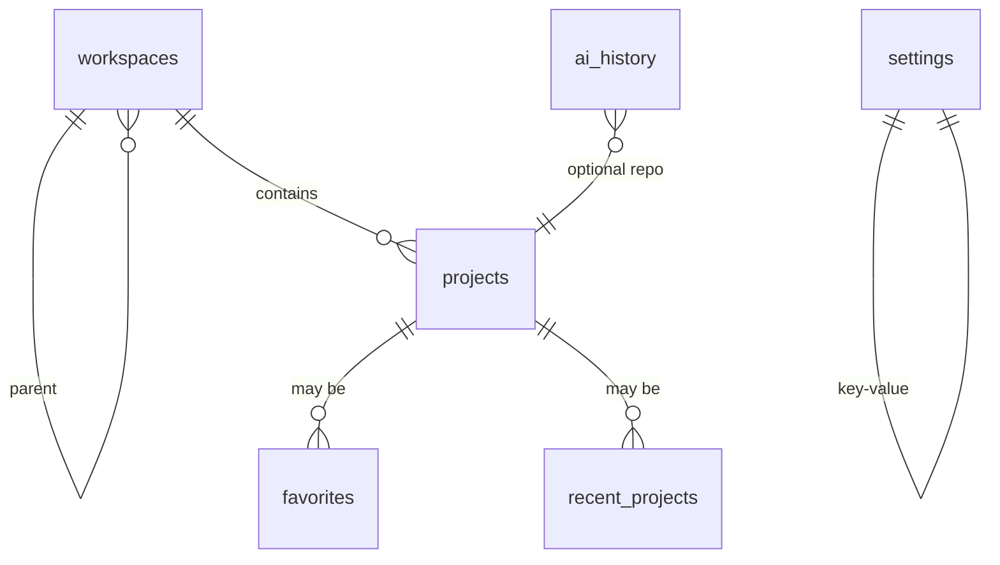

# 数据库设计

> **相关文档：** [overview](overview.md) · [tauri](tauri.md) · [state-management](../development/state-management.md) · [api/project](../api/project.md) · [api/settings](../api/settings.md)

JLGit 使用 **PostgreSQL**（Rust 侧 `sqlx`，连接池挂在 `AppState`）存储**应用数据**。Git 对象与引用仍由各仓库 `.git` 管理。

数据库**不随应用分发**：用户需自备本机或局域网的 PostgreSQL 实例，首次启动由配置向导（`/setup`）引导填写连接参数、建库并跑迁移。详见下方「首启配置」。

连接参数落在 Tauri Store 文件 `db-config.json`，与其他轻量偏好（`ai-secrets.json`、`git-accounts.json`）同放应用数据目录。该目录由 Tauri `identifier` 决定：

| 构建 | identifier | macOS 路径示例 |
|------|------------|----------------|
| `pnpm tauri build`（正式包） | `com.jingling.jlgit` | `~/Library/Application Support/com.jingling.jlgit/` |
| `pnpm tauri dev`（开发） | `com.jingling.jlgit.dev` | `~/Library/Application Support/com.jingling.jlgit.dev/` |

开发与正式包**不得**共用同一目录，也建议用不同的数据库名（如 `jlgit` / `jlgit_dev`），避免测试数据进入安装包体验。

---

## 设计原则

1. 表结构服务产品功能，不镜像 Git 对象模型
2. 所有迁移可重复、有版本号
3. 路径以文本存储；打开时再校验磁盘状态
4. 可空字段必须有产品语义；避免「万能 JSON 大列」滥用（配置可用 JSON 文本列）
5. 时间列沿用 `TEXT` 存 ISO-8601，与前端既有约定一致，不改用 `TIMESTAMPTZ`

---

## ER 概览



---

## 表定义

### `workspaces`

逻辑工作区（一组项目的集合，便于多客户/多公司切换）。

| 列 | 类型 | 说明 |
|----|------|------|
| `id` | TEXT PK | UUID |
| `parent_id` | TEXT NULL | 父分组 ID；NULL 表示根分组 |
| `name` | TEXT NOT NULL | 显示名 |
| `icon` | TEXT NOT NULL DEFAULT `''` | Lucide kebab-case 图标名，可空；非空时做格式校验 |
| `color` | TEXT NOT NULL DEFAULT `''` | 分组强调色 `#RRGGBB`，可空 |
| `locked` | BOOLEAN NOT NULL DEFAULT FALSE | 锁定：禁止拖动、移入/移出仓库、删除与调整父级 |
| `sort_order` | BIGINT NOT NULL DEFAULT 0 | 排序 |
| `created_at` | TEXT NOT NULL | ISO-8601 |
| `updated_at` | TEXT NOT NULL | ISO-8601 |

### `projects`

本地 Git 仓库登记。

| 列 | 类型 | 说明 |
|----|------|------|
| `id` | TEXT PK | UUID |
| `workspace_id` | TEXT NULL | FK → workspaces.id ON DELETE SET NULL；NULL 表示根级（未分组） |
| `name` | TEXT NOT NULL | 默认取文件夹名，可改 |
| `description` | TEXT NULL | 项目简介（可选；打开时可手填或 AI 生成） |
| `icon` | TEXT NOT NULL DEFAULT `''` | Lucide kebab-case 图标名，可空；非空时做格式校验 |
| `path` | TEXT NOT NULL UNIQUE | 规范化绝对路径 |
| `remote_url` | TEXT NULL | 主远端 URL（优先 origin）；空串表示已探测且无远端；NULL 表示尚未写入 |
| `last_opened_at` | TEXT NULL | 上次打开 |
| `pinned` | BOOLEAN NOT NULL DEFAULT FALSE | 置顶 |
| `sort_order` | BIGINT NOT NULL DEFAULT 0 | 分组内排序 |
| `created_at` | TEXT NOT NULL | |
| `updated_at` | TEXT NOT NULL | |

索引：`path` UNIQUE；`last_opened_at`；`workspace_id`。

### `favorites`

| 列 | 类型 | 说明 |
|----|------|------|
| `project_id` | TEXT PK | FK → projects.id ON DELETE CASCADE |
| `sort_order` | BIGINT NOT NULL DEFAULT 0 | |
| `created_at` | TEXT NOT NULL | |

### `recent_projects`

| 列 | 类型 | 说明 |
|----|------|------|
| `project_id` | TEXT PK | FK → projects.id ON DELETE CASCADE |
| `opened_at` | TEXT NOT NULL | 最近一次 |
| `open_count` | BIGINT NOT NULL DEFAULT 1 | |

应用层限制最近 N 条（如 20），超出淘汰最旧。

### `settings`

| 列 | 类型 | 说明 |
|----|------|------|
| `key` | TEXT PK | 如 `theme.mode`、`git.executable` |
| `value` | TEXT NOT NULL | JSON 文本 |
| `updated_at` | TEXT NOT NULL | |

常见键（约定，非强制枚举封闭）：

| key | 语义 |
|-----|------|
| `theme.mode` | `light` \| `dark` \| `system` |
| `locale` | `zh-CN` \| `en` |
| `git.executable` | 自定义 git 路径或空 |
| `git.defaultBranch` | 展示用默认名提示 |
| `ui.sidebarWidth` | 数字 |
| `ai.provider` | 提供商 id |
| `ai.enabled` | boolean |

轻量、高频、与窗口强相关的项也可进 Tauri Store；**产品设置页展示的项以本表为准**，避免双写。若用 Store，文档中标明键名且不与 settings 键冲突。

### `ai_history`

| 列 | 类型 | 说明 |
|----|------|------|
| `id` | TEXT PK | UUID |
| `project_id` | TEXT NULL | FK，可空（全局对话） |
| `kind` | TEXT NOT NULL | `commit_message` \| `diff_explain` \| `review` \| `branch_name` \| `release_notes` |
| `input_summary` | TEXT NOT NULL | 脱敏摘要，非全量 diff |
| `output` | TEXT NOT NULL | 模型输出 |
| `model` | TEXT NULL | |
| `created_at` | TEXT NOT NULL | |

面向提交建议等短历史（预留）。**单仓 / 多仓鲸灵多轮对话**不走本表，见下方 `chat_*`。

不存 API Key；密钥走系统安全存储或环境变量（见 security / ai 文档）。

### `chat_conversations` / `chat_messages`

多轮对话持久化：单仓鲸灵按项目归属，多仓鲸灵全局、仅手动删除。设置「数据」可按 scope 清理（见 `app_data_*`）。

| 表 | 列 | 说明 |
|----|----|------|
| `chat_conversations` | `id` TEXT PK | 会话 ID |
| | `scope` TEXT | `agent`（单仓）\| `agent_global`（多仓） |
| | `project_id` TEXT NULL | 单仓鲸灵必填，FK → `projects(id)` **ON DELETE CASCADE**；多仓鲸灵必须为 NULL |
| | `title` / `pinned` / `sort_order` | 展示与排序 |
| | `created_at` / `updated_at` | ISO 时间 |
| `chat_messages` | `id` TEXT PK | 消息 ID |
| | `conversation_id` TEXT | FK → `chat_conversations(id)` ON DELETE CASCADE |
| | `role` / `content` | `user` \| `assistant` 与正文 |
| | `reasoning_content` / `reasoning_duration_ms` | 深度思考全文与耗时（可空） |
| | `mentions_json` | 分支 mention 等（可空 JSON） |
| | `created_at` / `sort_order` | 时间与会话内顺序 |

写入时机：消息完成 / 停止并保留片段 / 编辑截断 / 重命名 / 置顶 / 重排 / 删除；不写流式中间帧。

---

## 首启配置

数据库不随包分发，因此启动顺序是：

```
main.ts → bootstrapLocalServer()
  → serverInfo（Command）拿内嵌服务端口与令牌
  → GET /api/setup/status
    → 未配通：路由守卫强制跳 /setup 向导
    → 已配通：进入主界面
```

向导四步：环境检测（探 `127.0.0.1:5432` 与 `psql`）→ 连接配置（试连）→ 初始化（按需建库 + 跑迁移 + 落盘装池）→ 完成。

未配通时，除 `/api/health` 与 `/api/setup/*` 外的接口统一返回 **503 + `DB_NOT_CONFIGURED`**，由 `state::Db` extractor 兜住，业务 Handler 不再判空。

接口契约见 [api/setup](../api/setup.md)。

---

## 迁移策略

1. 迁移脚本放 `src-tauri/migrations/`，用 `sqlx::migrate!` 在初始化时顺序执行
2. `sqlx` 自建 `_sqlx_migrations` 表记录版本与校验和
3. 迁移脚本只追加，不改已发布脚本内容（改动会导致校验和不匹配而拒绝启动）
4. 破坏性变更在 roadmap 大版本说明

`0001_init.sql` 是 PostgreSQL 下的全新起点：SQLite 时代的逐版本补列逻辑已一次性合并进初始脚本，**旧 SQLite 库不提供自动迁移**。

---

## 访问路径

```
src/api/*（requestClient）
  → HTTP /api/*（内嵌 Axum）或 Tauri Command（未迁完的域）
    → Handler → Service → Repository
      → sqlx → PostgreSQL
```

SQL 只出现在 `src-tauri/src/repositories/`；Service 不写 SQL，前端不拼接任意 SQL。

---

## 备份与隐私

- 备份/导入随本次迁移**下线**：整库快照改用 `pg_dump` / `pg_restore`，`app_data_export` / `app_data_import` 对旧调用方返回明确的不支持错误
- 连接口令存于 Tauri Store 的 `db-config.json`，不写日志、不进导出
- `ai_history.input_summary` 避免写入密钥与完整源码机密；用户可一键清空
- 卸载策略：应用数据目录遵循 OS 惯例；数据库由用户自行管理，卸载不会删库

---

## 决策：为何用 PostgreSQL 而非 Store / SQLite

| | Store | SQLite | PostgreSQL（采用） |
|--|-------|--------|-------------------|
| 查询 | 弱 | 强 | 强 |
| 关系 | 无 | 有 FK | 有 FK |
| 迁移 | 手工 | 版本化 | 版本化（`sqlx migrate`） |
| 与后端服务同构 | 无 | 弱 | 强（同一套 `sqlx` + SQL 方言） |
| 部署成本 | 零 | 零 | 需用户自备实例（由向导引导） |

选 PostgreSQL 是为了让内嵌 Axum 服务与将来可能的远端服务共用同一套数据访问代码与 SQL 方言；代价是多一步首启配置，用向导把这步做成一次性成本。Store 仅作补充，不是项目列表的真相源。
