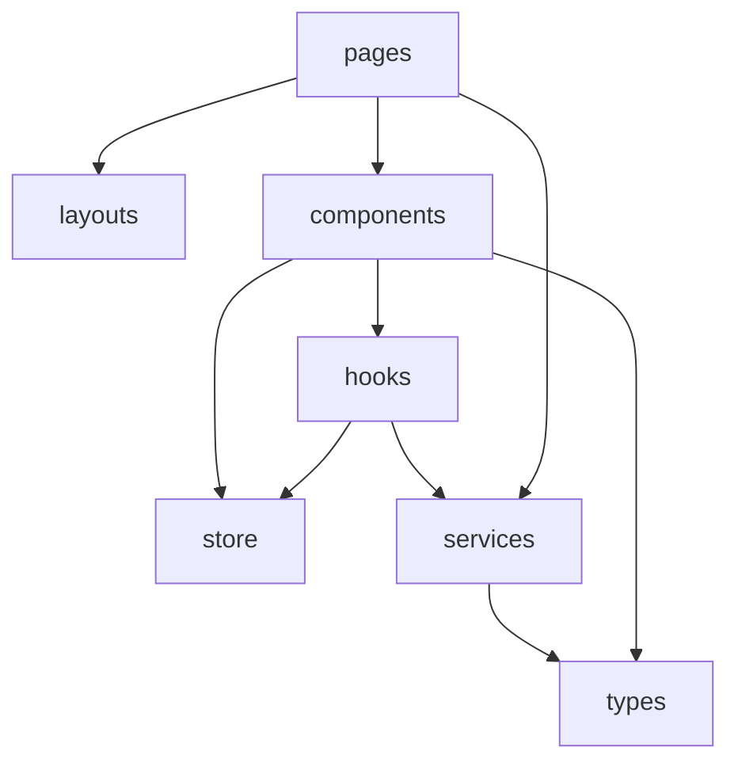

# 前端架构

> **相关文档：** [overview](overview.md) · [project-structure](../development/project-structure.md) · [state-management](../development/state-management.md) · [routing](../development/routing.md) · [coding-style](../development/coding-style.md)

---

## 目标

在 100+ 组件规模下仍保持：

- 页面可组合、Feature 可替换
- IO 集中在 Service
- 样式与主题通过 Tokens，组件不关心色值来源

---

## 分层

```
src/pages/*          路由页面：组装布局与 Feature
src/layouts/*        壳布局：侧栏、顶栏、工作区骨架
src/components/*     可复用 UI 与领域组件
src/hooks/*          可复用副作用与订阅
src/store/*          Zustand stores
src/services/*       Tauri / 持久化门面
src/types/*          跨模块 DTO 与领域类型
src/utils/*          纯函数工具
src/design/*         Design Tokens、主题 CSS、Monaco 主题桥接
src/index.css        样式入口（转发至 design）
```

### Page

- 一个路由对应一个 Page（或懒加载包装）
- 负责：读取路由参数、触发初始加载、把数据/回调传给 Feature
- 不负责：Git 输出解析、SQL 语句

### Feature 组件

按领域放在 `components/git`、`components/project` 等：

- `CommitPanel`、`BranchSwitcher`、`ProjectCard`
- 可依赖 hooks 与 store；通过 props 保持可测性

### UI 基础组件

`components/ui`：通过 [shadcn/ui](https://ui.shadcn.com/) CLI **按需**生成的官方组件与必要薄封装。  
业务组件不得复制 Button/Input/Dialog 等视觉实现，应组合 ui 层。引入方式见 [ui-guidelines · shadcn/ui](../development/ui-guidelines.md#shadcnui)。

---

## 依赖方向



禁止：

- `services` 导入 `components` / `pages`
- `utils` 导入 React 组件
- `components/ui` 导入业务 store

---

## 与 Service 的边界

```ts
// 允许：Page / Hook
await gitService.getStatus(repoPath)

// 禁止：Component 内直接
await invoke("git_status", { repoPath })
```

例外：`services` 内部的 `invoke` 封装文件（如 `services/tauri.ts`）可统一处理日志与错误。

Service 契约见 [api/](../api/git.md)。

---

## 状态归属速查

| 数据 | 放哪 |
|------|------|
| 输入框草稿 | Local state |
| 当前选中文件路径 | Zustand（仓库会话） |
| 主题偏好 | Store + 持久化（Store 插件或 settings 表） |
| 已保存项目列表 | SQLite → 经 ProjectService 加载到 Store |
| `git status` 结果 | Zustand 缓存，以 Git 为准可刷新 |

详见 [state-management](../development/state-management.md)。

---

## 路由与代码分割

- 路由表集中在 `src/router`
- 重页面（Diff、Graph、设置）使用 `React.lazy` + `Suspense`
- 仓库内子视图可用嵌套路由：`/repo/:id/status`、`/repo/:id/history`

详见 [routing](../development/routing.md)。

---

## 表单与校验

- React Hook Form 管理表单状态
- Zod 定义 schema，与 TypeScript 类型同源（`z.infer`）
- 提交时在 Service 前完成客户端校验；服务端（Rust）仍做路径与权限校验

---

## 错误与反馈

```
Service throw / Result
  → Hook catch
    → toast（sonner）或页面内 Alert
    → 可选写入 log
```

用户可读文案走 i18n；技术细节进日志。

---

## 测试切入点

| 层 | 测什么 |
|----|--------|
| utils | 纯函数 |
| services | mock `invoke` |
| components | 交互与可访问性（后续） |
| pages | 轻量集成 |

策略见 [testing](../development/testing.md)。

---

## 扩展：AI 与托管平台

- AI 面板作为 Feature，经 `services/ai`，不塞进 `gitService`
- GitHub 等集成经 `services/hosting`，UI 只消费「PR / Issue」视图模型

产品说明：[ai](../product/ai.md)
