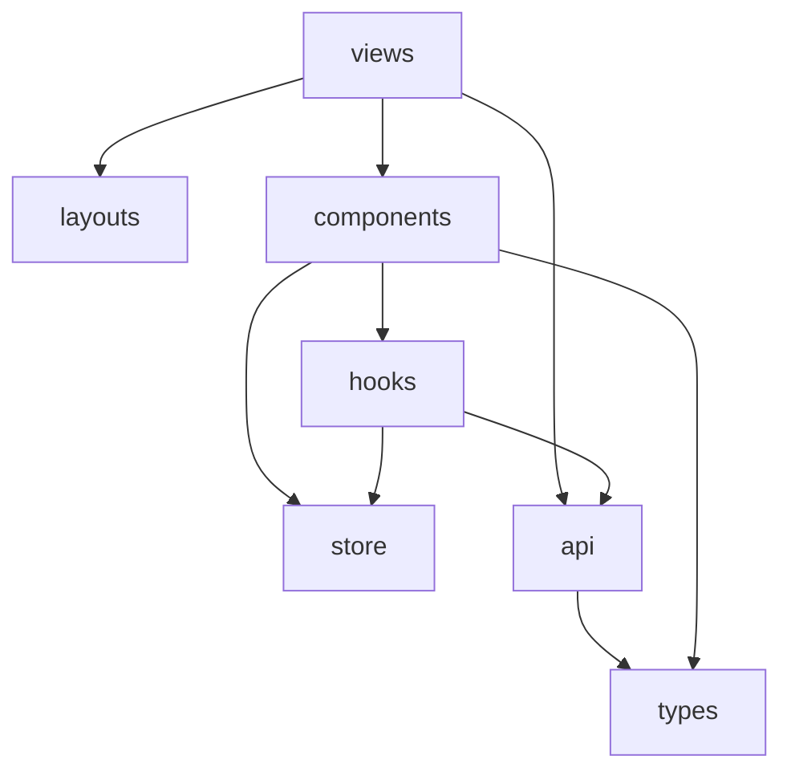

# 前端架构

> **相关文档：** [overview](overview.md) · [project-structure](../development/project-structure.md) · [state-management](../development/state-management.md) · [routing](../development/routing.md) · [coding-style](../development/coding-style.md)
>
> 工程结构与命名对齐 **work-center-web**；本地 Command 与外部 HTTP **只**走 `src/api/`。

---

## 目标

在 100+ 组件规模下仍保持：

- 页面可组合、Feature 可替换
- 后端 IO 集中在 `src/api/`
- 样式与主题通过 Tokens，组件不关心色值来源
- 路由页就近分层：camelCase 目录 + `index.vue` + `components/` + `hooks/` + `utils/`

---

## 分层

```
src/views/*          路由页面：camelCase 目录，入口 index.vue 只做编排
src/layouts/*        壳布局（vben 2 目录）：default / page / iframe
src/components/*     跨页面可复用 UI（PascalCase 封装目录或领域目录）
src/hooks/*          应用级组合式（setting / web / core / event / component）
src/store/*          Pinia（index.ts + plugin/ + modules/）
src/api/*            后端接口：本地 Command 与外部 HTTP，均走 requestClient
src/types/*          跨模块 DTO 与领域类型
src/utils/*          纯函数工具；HTTP 封装在 utils/http/
src/locales/*        vue-i18n
src/design/*         Design Tokens、主题 CSS、Monaco 主题桥接
```

### View

- 一个路由对应一个 `views/<camelCase>/index.vue`（`defineOptions` 仍用 PascalCase 组件名）
- 负责：读取路由参数、触发初始加载、把数据/回调传给 Feature
- 不负责：Git 输出解析、SQL 语句、堆私有 hook 在模块根目录

### Feature 组件

- **跨页复用**：`components/Git`、`components/Project`、`components/Icon`（只经 `index.ts`）
- **仅本页**：`views/<module>/components/`
- 可依赖 hooks 与 store；通过 props / emit 保持可测性

### UI 基础组件

基础控件直接局部导入 [antdv-next](https://www.antdv-next.com/)。  
业务组件不得复制 Button / Input / Modal 等视觉实现。引入方式见 [ui-guidelines · antdv-next](../development/ui-guidelines.md#antdv-next)。

---

## 依赖方向



禁止：

- `api` 导入 `components` / `views`
- `utils` 导入 Vue 组件
- 可复用 `components/*` 导入某个 `views/*` 的私有实现
- View / 组件内直接 `axios.create` 或 `invoke`

---

## 与 api 的边界

```ts
// 允许：View / Hook / Store
await listProjects()
await getWorkspaceTree()
await getStatus(repoPath)
await getDeepSeekModels(...)

// 禁止：Component 内直接
await invoke("git_status", { repoPath })
await axios.get("/v1/models")
```

例外：`utils/http` 统一 Axios（含 Tauri adapter）。页面只调用 `src/api/`。

- 本地 Command：`src/api/` + 小驼峰地址，如 `requestClient.get("projectList")`、`requestClient.post("gitStatus", { path })`
- 外部 HTTP：同一套 `requestClient`，完整 `https://` URL
- 禁止为同一个 Command 再写 `services` 1:1 包装
- 非接口逻辑（主题写 DOM、开子窗、Agent 循环）放 `hooks/` / `utils/`

接口契约见 [api/](../api/git.md)。

---

## 状态归属速查

| 数据 | 放哪 |
|------|------|
| 输入框草稿 | Local state（`ref`） |
| 当前选中文件路径 | Pinia（仓库会话） |
| 主题偏好 | Store + persist / Tauri Store |
| 已保存项目列表 | SQLite → 经 `src/api/project` 加载到 Store |
| `git status` 结果 | Pinia 缓存，以 Git 为准可刷新 |

详见 [state-management](../development/state-management.md)。

---

## 路由与代码分割

- 路由表集中在 `src/router/routes/`
- 路由实例在 `src/router/index.ts` 经 `setupRouter(app)` 注册
- 重页面（Diff、Graph、设置）使用 `defineAsyncComponent` 或路由 `() => import(...)`
- 仓库内子视图可用嵌套路由：`/repo/:project-id/status`、`/repo/:project-id/history`

详见 [routing](../development/routing.md)。

---

## 表单与校验

- 业务提交表单用 `useForm`：一个 reactive `form` 对象放字段，校验用 antdv-next `rules`
- `Form` 必须绑 `:model` + `:rules`（无 `model` 时 `@finish` 不会触发）；主提交走 `@finish`，次按钮先 `validate()`
- 瞬时状态（loading / picking）可留独立 `ref`，不要每个字段一个 `ref`
- 字段错误展示在 `FormItem` 上，禁止用 `message.error` 代替必填校验
- 提交时在 Service 前完成客户端校验；服务端（Rust）仍做路径与权限校验
- **弹窗表单**：弹窗组件 `defineExpose({ open })`，父组件 `ref.open(payload)`；禁止外绑 `:open` / `mode`。二次确认走 `useModal().confirm()`。细则见 [ui-guidelines · 弹窗开合](../development/ui-guidelines.md#弹窗开合硬性)

---

## 错误与反馈

```
Service throw / Result
  → Hook catch
    → message / notification 或页面内 Alert
    → 可选写入 log
```

用户可读文案走 i18n；技术细节进日志。

---

## 测试切入点

| 层 | 测什么 |
|----|--------|
| utils | 纯函数 |
| api | mock `requestClient` |
| components | 交互与可访问性（后续） |
| views | 轻量集成 |

`*.spec.ts` 与实现文件同目录。策略见 [testing](../development/testing.md)。

---

## 扩展：AI 与托管平台

- AI 面板作为 Feature，网络请求经 `api/`，会话持久化走对应 Command 接口
- GitHub 等集成经 `api/`，UI 只消费「PR / Issue」视图模型

产品说明：[ai](../product/ai.md)
