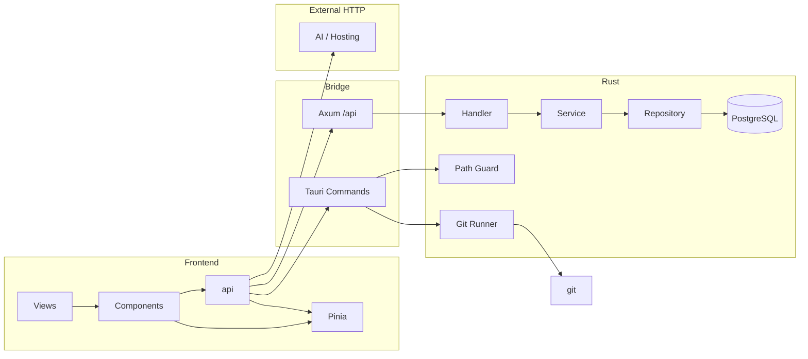
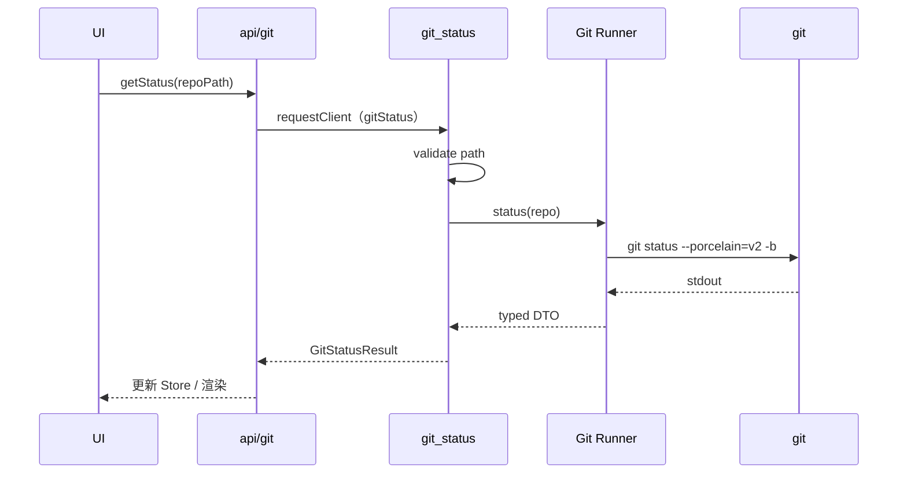

# 架构总览

> **相关文档：** [frontend](frontend.md) · [tauri](tauri.md) · [git](git.md) · [database](database.md) · [command](command.md) · [AGENTS.md](../../AGENTS.md)

本文描述 JLGit 的**目标架构**：分层、数据流、边界与关键决策。实现进度见 [feature-list](../product/feature-list.md)。

---

## 为什么这样分层

桌面 Git 客户端同时触及：

- 高频 UI 交互（Vue）
- 系统能力（对话框、通知、FS）
- 外部进程（`git`）
- 本地持久化（项目列表、设置、AI 历史）

若 UI 直接调 Git 或拼 shell，会出现：注入风险、无法统一错误模型、无法替换执行后端、AI 改码时边界模糊。

因此采用严格单向依赖：

```
Vue UI
  → Router / View
    → Feature / Component
      ├─ api（TS）→ Axios requestClient
      │    ├─ /api/* → 内嵌 Axum（Router → Handler → Service → Repository → PostgreSQL）
      │    ├─ 小驼峰地址 → Tauri Command（Git / FS / 系统能力）
      │    └─ https URL → 外部 HTTP
```



两条本地通道并存是**迁移期的中间态**：数据类接口逐域迁到 `/api/*`，Git / FS / 系统能力仍走 Command。前端调用方无感知，因为两者都在 `src/api/` 以 `requestClient` 声明。

---

## 各层职责

| 层 | 职责 | 不负责 |
|----|------|--------|
| **View** | 路由级布局、组合 Feature、页面级数据加载入口 | 解析 `git status` 文本 |
| **Feature / Component** | 展示与交互；调用 hooks / store / api | 直接 `invoke`、直接 `axios`、直接读盘 |
| **Hook** | 封装订阅与副作用（刷新 status、监听焦点） | 隐藏业务规则到「魔法」副作用 |
| **Store (Pinia)** | 会话级全局状态（当前仓库、UI 面板） | 永久真相（应落库的数据） |
| **api** | 全部后端 IO：`requestClient`（`/api/*`、小驼峰 Command 或 https URL） | 页面内直接 `invoke` / `axios`；Agent 循环 / 改 DOM |
| **Tauri Command** | 稳定 IPC 契约；参数校验；调用 Rust 域逻辑 | 复杂 UI 决策 |
| **Handler** | 只管 HTTP：取参、反序列化、状态码、套信封 | 业务规则、SQL |
| **Service** | 业务规则与编排（唯一性校验、锁定判定、事务边界） | 直接写 SQL、感知 HTTP |
| **Repository** | 唯一写 SQL 的地方；行 → 领域模型 | 业务分支判断 |
| **Rust 域模块** | Git 执行、路径安全、系统 API | Vue 状态形状 |
| **Git CLI** | 版本控制真相源 | 应用配置、窗口状态 |

前端分层展开：[frontend.md](frontend.md)  
Rust / 插件：[tauri.md](tauri.md)  
Git 执行模型：[git.md](git.md)

---

## 关键决策（ADR 风格）

### ADR-1：Git 通过系统 CLI，而非纯 libgit2 绑定

| | |
|--|--|
| **选择** | Rust 侧用参数数组调用本机 `git` |
| **原因** | 行为与用户本机 Git 一致（hooks、credential helper、配置）；实现面更小；易对照文档排查 |
| **备选** | 纯 `git2` / `gix`：无外部依赖，但配置/凭据/LFS 行为易与 CLI 分叉 |
| **代价** | 依赖本机安装 Git；需处理版本差异 |
| **扩展** | 未来可对热点路径引入库解析，但对外仍保持 Command 契约不变 |

### ADR-2：PostgreSQL 存应用数据，不存 Git 对象

| | |
|--|--|
| **选择** | 项目、设置、收藏、工作区、鲸灵会话进 PostgreSQL（Rust 侧 `sqlx`），Git 对象仍归 `.git` |
| **原因** | Git 对象已由 `.git` 管理，重复存储易不一致；换 PG 后内嵌服务与将来可能的远端服务共用同一套 SQL 方言与数据访问代码 |
| **备选** | SQLite（原方案）：零部署，但与服务端形态分叉；仅 JSON / Store：查询与迁移弱 |
| **代价** | 数据库不随包分发，用户需自备实例 → 用首启向导（`/setup`）把这步做成一次性成本；SQLite 旧库不提供自动迁移；备份/导入改用 `pg_dump` |
| **详见** | [database.md](database.md) |

### ADR-3：本地后端用内嵌 Axum HTTP 服务，而非只用 Tauri Command

| | |
|--|--|
| **选择** | Tauri 启动时在 `127.0.0.1:0`（临时端口）拉起 Axum，前端数据类接口走 `/api/*` REST |
| **原因** | 与普通 Web 后端同构：同一套 Router / Handler / Service / Repository 分层、同一套 `{ code, message, data }` 信封与 HTTP 状态码，将来整体搬到远端服务不必重写；也便于用 curl 直接调试 |
| **边界** | 只监听回环地址，不对外暴露；每次启动生成一次性 token，经 `server_info` Command 下发，中间件校验 Bearer |
| **备选** | 全部留在 Command：IPC 契约稳定但错误模型与分层要另起一套，且无法复用到服务端 |
| **代价** | 多一层进程内 HTTP 开销（回环，可忽略）；迁移期两条通道并存 |
| **详见** | [tauri.md](tauri.md) · [command.md](command.md) |

### ADR-4：后端 IO 只走 api

| | |
|--|--|
| **选择** | `/api/*`、本地 Command 与外部 HTTP 都只在 `src/api/` 用 `requestClient` 声明 |
| **原因** | 对齐 Vben2 / work-center-web；三种通道调用方式一致；页面不散落 `invoke` / `axios.create`，也不再包一层 1:1 `services` |
| **不放 api 的** | 写 `document`、开子窗、Agent 工具环等非接口逻辑 → `hooks/` / `utils/` |
| **代价** | 已把 Git / 系统 Command 收进 `src/api/`；`services/` 只留非接口编排 |

### ADR-5：Pinia 唯一全局状态方案

| | |
|--|--|
| **选择** | 不用第二套全局状态库；目录名固定 `src/store` |
| **原因** | 与 Vue 3 官方生态一致，对齐 work-center-web；API 小、心智负担低 |
| **详见** | [state-management](../development/state-management.md) |

### ADR-6：目标架构文档先行

| | |
|--|--|
| **选择** | 文档描述目标形态；用 Feature List 跟踪 Done |
| **原因** | 脚手架阶段即可约束 AI 与贡献者，避免分叉实现 |

---

## 数据流示例：查看仓库 Status



错误在任一环失败时：Rust 返回 `{ code, message }` → Service 转为领域错误 → UI toast / 内联提示。  
错误码约定见 [command.md](command.md)。

---

## 前端状态 vs 持久化

```
Local State     组件内瞬时 UI（输入框、悬停）
     ↓
Pinia           当前仓库、选中文件、面板开关（会话）
     ↓
PostgreSQL      项目列表、设置、收藏、鲸灵会话（跨启动）
```

Git 工作区内容**不以**数据库为真相源；每次以 Git 查询为准，Store 只做缓存。

---

## 安全与性能在架构中的位置

- **安全**：路径校验与 Git 参数化集中在 Rust；capabilities 最小开放。见 [security](../development/security.md)
- 性能：大列表虚拟化在前端；重 Git 操作可后续迁入异步/队列，不改变 api 契约。见 [performance](../development/performance.md)

---

## 未来扩展点（不改主干）

| 能力 | 挂载点 |
|------|--------|
| AI | `src/api/`（模型/余额 HTTP）+ `services/ai`（Agent 循环）+ 可选 Rust 代理；见 [ai](../product/ai.md) |
| 插件 | Command 注册表 + 能力清单（v1 后） |
| GitHub/GitLab/Gitea/Gitee | `src/api/hosting/*`，UI 经同一仓库上下文 |
| 多窗口 | Tauri 多 Window + 按窗口 Store 切片 |
| Cloud Sync | 同步「应用数据」表，不同步 `.git` |

扩展原则：**加模块，不改调用方向**。

---

## 与代码目录的映射

| 架构层 | 目录 |
|--------|------|
| Views / Layouts | `src/views`、`src/layouts` |
| Components | `src/components/**` |
| HTTP / Command api | `src/api/**`、`src/utils/http/**` |
| Store | `src/store/**` |
| 内嵌服务与路由 | `src-tauri/src/server/**`、`src-tauri/src/state/**` |
| Handler / Service / Repository | `src-tauri/src/handlers/**`、`services/**`、`repositories/**` |
| 领域模型与信封 | `src-tauri/src/models/**` |
| Commands | `src-tauri/src/commands/**` |
| Git Runner | `src-tauri/src/git/**` |
| 迁移脚本 | `src-tauri/migrations/**` |

目录细则：[project-structure](../development/project-structure.md)
