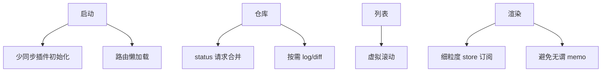

# 性能

> **相关文档：** [frontend](../architecture/frontend.md) · [git](../architecture/git.md) · [ui-guidelines](ui-guidelines.md)

---

## 目标（指导值）

| 指标 | 目标 | 备注 |
|------|------|------|
| 冷启动 → 可交互 | ≤ 2s | 典型开发机；不含首次编译 |
| 打开已登记仓库 → Status 可见 | ≤ 500ms | 中小仓库；含一次 `git status` |
| 提交列表滚动 | 60fps | 虚拟列表 |
| Diff 打开（常规文本） | ≤ 300ms 首屏 | 超大文件截断 |
| 空闲内存 | 尽量克制 | 避免常驻多份全量 diff |

数字用于指导设计，不是对外 SLA 营销。

---

## 策略地图

---

## 启动

- 首屏只加载 Dashboard 必要代码
- Monaco、Graph、Markdown 重型库跟路由懒加载
- SQLite 预加载已在配置中；避免启动时跑全表重查询

---

## 仓库加载

- 打开仓库：并行「项目元数据（DB）」+ `git_status`，不要串行无谓等待
- `git_log` 分页；进入 History 再拉
- 切换仓库：优先还原会话缓存再后台刷新；冷开仓才清空 store，避免闪现旧数据与切标签卡顿

---

## 虚拟滚动

适用：文件更改列表、提交历史、分支多时。

使用 `@tanstack/react-virtual`（已在依赖中）。固定或估算行高，避免测量抖动。

已落地：

- Agent 消息列表（`AgentMessageList`）
- 变更 / 待提交（列表 + 树形，`ChangesPanel`）
- 分支树（`BranchList`，展平可见行）
- 标签列表（`TagList`）

约定：`ScrollArea` + Radix viewport 作为 `getScrollElement`（见 `useScrollAreaViewport`）；树结构先按展开状态展平再虚拟化。

---

## Diff

- 默认按文件加载 patch，不一次拉全仓库 diff
- `maxBytes` / `truncated` 与 Command 契约一致
- 二进制跳过
- Monaco 仅在需要编辑/高级展示时挂载

---

## 缓存

| 数据 | 策略 |
|------|------|
| status | 内存缓存 + 写后失效 |
| branches | 写分支后失效；可短 TTL |
| settings | 启动加载，变更时更新 |
| AI 结果 | 历史表；不自动当真相 |

禁止用 localStorage 缓存巨型 patch。

---

## 后台任务

- fetch/push：可显示进度；完成后通知（用户允许时）
- 未来：文件监听 debounce → 刷新 status
- 重任务不阻塞 UI 线程（Rust 异步 / spawn）

---

## 渲染纪律

- Store 用 selector
- 列表 item 回调稳定（必要时再优化）
- 先 Profiler / 实测，再加 `memo`

---

## 性能回归检查（发布前）

- [ ] 大仓库（数千文件）打开 Status 是否可接受
- [ ] 长 log 滚动是否掉帧
- [ ] 重复进出仓库是否泄漏（订阅、监听）
