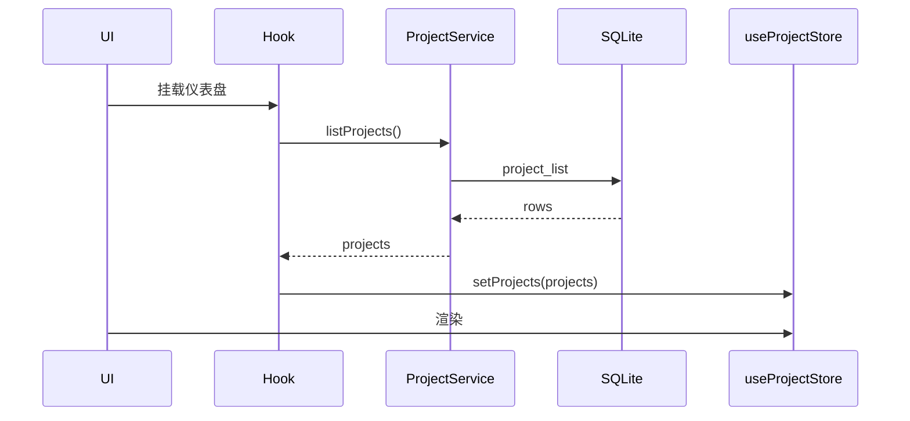

# 状态管理

> **相关文档：** [frontend](../architecture/frontend.md) · [database](../architecture/database.md) · [AGENTS.md](../../AGENTS.md)

---

## 优先级

```
Local State → Zustand → SQLite
```

| 层级 | 何时用 | 示例 |
|------|--------|------|
| Local | 仅单组件关心 | 输入框、popover 开关 |
| Zustand | 跨组件会话状态 | 当前项目、选中文件、status 缓存 |
| SQLite | 跨启动、需查询 | 项目列表、设置、AI 历史 |

不要用 Context 做全局业务状态。不要引入第二套全局库。

---

## Zustand 约定

- 文件：`src/store/useXxxStore.ts`
- 导出：`useXxxStore`
- 按域拆分：`useProjectStore`、`useGitStore`、`useUiStore`、`useSettingsStore`
- 可选用 `subscribeWithSelector`；避免一个巨型 store

```ts
interface GitState {
  status: GitStatusResult | null;
  selectedPaths: string[];
  setStatus: (status: GitStatusResult | null) => void;
  setSelectedPaths: (paths: string[]) => void;
  reset: () => void;
}
```

### 规则

1. Store **不**直接 `invoke`；由 Service / Hook 写入
2. 切换仓库时调用 `reset()`，防止串数据
3. 选择器取值，避免整树订阅导致重渲染：

```ts
const branch = useGitStore((s) => s.status?.branch);
```

4. 派生数据优先在 selector 或 utils 计算，不在每个组件复制逻辑

---

## 与 SQLite 的同步



- 写路径：UI → Service → DB →（成功）更新 Store
- 禁止只改 Store 假装已持久化

---

## Git 状态缓存

- `git status` 结果放 `useGitStore`
- 真相源仍是 Git；任何写操作成功后必须刷新
- 可对 status 请求做 in-flight 合并（debounce / shared promise）

---

## 设置状态

- `useSettingsStore` 持有运行时设置
- 启动时 `settings_get_all` 注入
- 变更：乐观更新 UI + `settings_set`；失败则回滚并 toast

主题类设置还需同步 DOM class / CSS，见 [theme](theme.md)。

---

## 反模式

- 把表单全程塞进 Zustand
- 在 store 里导入 React 组件
- 深度克隆整棵巨大状态代替细粒度更新
- 用 SQLite 缓存每次 keystroke
