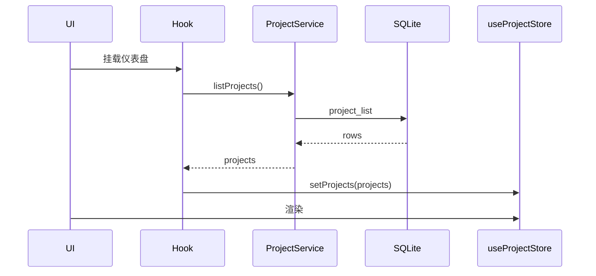

# 状态管理

> **相关文档：** [frontend](../architecture/frontend.md) · [database](../architecture/database.md) · [AGENTS.md](../../AGENTS.md)
>
> 约定对齐 **work-center-web**：Pinia、`src/store` 单数、`setupStore(app)`。

---

## 优先级

```
Local State → Pinia → SQLite
```

| 层级 | 何时用 | 示例 |
|------|--------|------|
| Local | 仅单组件关心 | 输入框、popover 开关 |
| Pinia | 跨组件会话状态 | 当前项目、选中文件、status 缓存；不含请求 loading / error |
| SQLite | 跨启动、需查询 | 项目列表、设置、AI 历史 |

不要用 provide/inject 做全局业务状态。不要引入第二套全局库。不要创建 `src/stores/`。

---

## Pinia 约定

- 实例：`src/store/index.ts` 的 `setupStore(app)`
- 模块文件：`src/store/modules/<domain>.ts`（对齐 [vben 2 store](https://github.com/vbenjs/vue-vben-admin/tree/v2/src/store)：**文件名不用 `use` 前缀**）
- 插件：`src/store/plugin/`（`persist.ts` + 旧 `{ state, version }` 信封兼容）
- 导出：`useXxxStore`；组件外 / `setup` 前用同文件的 `useXxxStoreWithOut()`（内部 `useXxxStore(store)`），禁止再调用 `.getState()`
- 按域拆分：`locale.ts`、`theme.ts`、`setting.ts`、`app.ts`、`multipleTab.ts`、`repo.ts`、`project.ts`、`agentChat.ts`…
- 避免一个巨型 store；`index.ts` 只 `createPinia` + `setupStore`，不要 barrel 导入各 module（防循环）

```ts
export const useRepoStore = defineStore("repo", {
  state: (): { status: GitStatusResult | null; selectedPaths: string[] } => ({
    status: null,
    selectedPaths: [],
  }),
  actions: {
    setStatus(status: GitStatusResult | null) {
      this.status = status;
    },
    setSelectedPaths(paths: string[]) {
      this.selectedPaths = paths;
    },
    reset() {
      this.status = null;
      this.selectedPaths = [];
    },
  },
});
```

### 规则

1. Store **不**直接 `invoke`；由 Service / Hook 写入
2. 仓库状态按规范化路径隔离；切换时还原目标仓会话，冷开仓才重置展示数据
3. 组件里按 Vben 2 方式取状态：`useXxxStore()` + `storeToRefs` 解构 state/getter；action 留在 store 实例上。派生字段再用 `computed`，禁止自造 `useStoreSelector`：

```ts
import { storeToRefs } from "pinia";

const repoStore = useRepoStore();
const { status, selectedChange } = storeToRefs(repoStore);
const branch = computed(() => status.value?.branch);

repoStore.setStatus(next);
```

4. 派生数据优先在 getter 或 utils 计算，不在每个组件复制逻辑
5. 仅将语言、侧栏、亮暗主题等用户偏好 persist 到 localStorage；未经约定不得持久化密钥
6. getter / 计算属性禁止每次返回新 `[]` / `{}`（用模块级空常量），避免无限更新
7. 偏好 persist 的 localStorage 键保持 `jlgit-locale` / `jlgit-theme` / `jlgit-app-prefs` / `jlgit-open-tabs` / `jlgit-shortcuts`；读写 `{ state, version }` 信封（`store/plugin/zustandPersist.ts`），以便旧数据与跨窗口水合

---

## 与 SQLite 的同步



- 写路径：UI → Service → DB →（成功）更新 Store
- 禁止只改 Store 假装已持久化

---

## Git 状态缓存

- `git status` 结果放 `useRepoStore`（或等价域 store）
- 真相源仍是 Git；任何写操作成功后必须刷新
- 可对 status 请求做 in-flight 合并（debounce / shared promise）
- 异步 Git 操作在第一次 `await` 前捕获 `repoPath` 与查询偏好；完成、失败和后续刷新都只回写发起仓库
- `loading` / `error` 必须按仓库隔离。A 仓操作未完成时切到 B，B 不继承 A 的状态；切回 A 要恢复 A 的 pending 状态
- 禁止在复合操作的 `await` 间隙重新读取“当前仓库”作为 Git 命令目标

---

## 设置状态

- `useSettingsStore` 持有运行时设置
- 启动时 `settings_get_all` 注入
- 变更：乐观更新 UI + `settings_set`；失败则回滚并提示

主题类设置还需同步 DOM class / CSS，见 [theme](theme.md)。

---

## 反模式

- 把表单全程塞进 Pinia
- 在 store 里导入 Vue 组件
- 深度克隆整棵巨大状态代替细粒度更新
- 用 SQLite 缓存每次 keystroke
