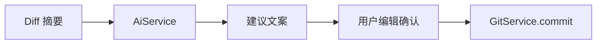

# AI 能力设计

> **相关文档：** [roadmap](roadmap.md) · [database](../architecture/database.md) · [security](../development/security.md) · [api](../api/git.md)

AI 是 **辅助层**，不是 Git 的替代执行器。所有副作用（commit、push、删分支）必须经现有 Git Command，并由用户确认。

当前已落地 DeepSeek 提交文案建议与鲸灵对话的流式回复。其余能力仍按路线图逐步实现。

---

## 设计原则

1. **建议 ≠ 执行**：模型输出先展示，用户编辑后再提交
2. **最小上下文**：只上传完成任务所需的 diff/摘要，可截断
3. **可配置**：无 DeepSeek API Key 时，提示用户在设置中配置，不阻塞 Git 主路径
4. **最小实现**：当前只接入 DeepSeek `deepseek-chat`，后续提供商扩展须经统一 `AiService`

---

## 能力列表

| 能力 | 输入 | 输出 | 用户下一步 |
|------|------|------|------------|
| **AI Commit Message** | 暂存区 diff 摘要 + 可选风格 | 标题/正文候选 | 编辑后 `git_commit` |
| **AI Diff Explain** | 单文件或提交 patch | 结构化说明 | 只读 |
| **AI Review** | 变更集 | 风险点/建议列表 | 只读；可一键复制评论 |
| **AI Branch Naming** | 变更摘要 / issue 标题 | 分支名候选 | 确认后 `git_branch_create` |
| **AI Release Notes** | 提交区间 log | 分类说明草稿 | 复制到 Release |

---

## 架构挂载

```
UI（AiPanel / Commit 旁按钮）
  → AiService
      → GitService.getStagedDiff
      → DeepSeek Chat Completions API
  → 用户确认
      → GitService / 其他 Service
```



- **不要**把 AI 逻辑塞进 `gitService`
- **不要**让模型返回的字符串直接当 shell

## 鲸灵：单仓 / 多仓

对内开发统一称 **单仓鲸灵** / **多仓鲸灵**（产品名都叫鲸灵，同一套 Agent）。设计详见 [统一鲸灵设计](../superpowers/specs/2026-07-21-unified-jingling-agent-design.md)。

| | 单仓鲸灵 | 多仓鲸灵 |
|--|----------|----------|
| 位置 | 主窗仓库面板 | 独立子窗 |
| 上下文 | **仅**当前 `projectId` / `repoPath` | 已登记多仓只读画像（首期） |
| 写 Git | 仅经现有确认流（若能力已开） | **不做**跨仓写 |
| 输入 `@` | 仅插件（无分支 @） | 插件 / 项目 |
| 插件 | 同一套壳；简历等 | 同左；简历可点名多仓 |
| 会话桶 | `project_id` 必填；删项目 CASCADE | `project_id` 空；仅手动删 |

- **插件壳：** 「新增会话」下方「插件」进入目录；内含「插件 / 技能」分段切换（共用 `AgentCatalogPanel`）。首期内置插件「简历」；技能目录暂为空态占位。可用 `@简历` / `@项目名` 或自然语言触发；无 Composer 快捷 chip。不做插件市场。
- **持久化：** 会话写入 SQLite（`chat_conversations` / `chat_messages`，含 `reasoning_content`）。单仓绑定 `project_id`（scope=`agent`）；多仓 `project_id` 为空（scope=`agent_global`；历史 `jinglv` / `resume_helper` scope 已迁移）。打开项目 / 打开多仓子窗时 hydrate；消息完成、停止、编辑截断、重命名/置顶/重排/删除时 upsert，不写流式中间帧。
- **单仓**每次请求读取**当前项目**只读 Git 快照（状态、分支、近期提交；询问文件列表时才拉 HEAD 文件树），不得混入其它项目。用户询问最近一次提交或引用近期短 SHA 时按需补文件列表；追问具体改动时最多 6 个文件限长 patch。工作区/未提交变更同理。回复用通俗语言直接答问；发送时先上屏用户消息再异步拉快照。
- 单仓中用户明确点名两个已知分支时，可只读比较提交区间（不写 Git）。
- 需要 Git 问答时，必须显式传入当前项目路径与用户选择的上下文，禁止用其它标签或全局缓存推断。

---

## 上下文与隐私

| 规则 | 说明 |
|------|------|
| 截断 | 暂存区 patch 服务端与前端均限制为最多 64 KiB |
| 脱敏 | 发送前掩码常见 API Key、token、密码与 PEM 私钥形式 |
| 密钥 / 指令 | 不进 SQLite；设置抽屉经 Tauri Store（`ai-secrets.json`）保存 DeepSeek API Key 列表、提交指令与拉取请求指令 |

---

## 当前提供商配置

- 提供商：DeepSeek
- Endpoint：`https://api.deepseek.com/chat/completions`
- 模型：提交文案为 `deepseek-chat`；**单仓/多仓鲸灵** 为 `deepseek-v4-pro`（共用 `AgentReasoningBlock`）。输入框均可切换「深度思考」（默认开；关闭时 `thinking: disabled`）。助手可「重新生成」；用户消息可内联「修改」后截断重发
- 设置 → 鲸灵：API Key、余额、`GET /user/balance`、「去充值」（多仓鲸灵从状态栏入口打开；简历规则由插件内置 prompt 固定，设置页不再提供指令编辑）
- 附加指令：提交 / 拉取请求仍可读已存配置或 JLGit 默认；简历不再使用用户自定义指令

网络错误、401、超时 → toast；不阻塞 Git 主路径。

---

## UX 要点

- Commit 区：「生成提交信息」按钮；仅有待提交文件时可用，生成中禁用
- 鲸灵对话：发送后展示深度思考（`AgentReasoningBlock`）与正文流式输出；增量按动画帧写入消息列表；请求失败或超时保留已收到的内容并提示用户
- 建议结果默认包含 Conventional Commit 标题及基于 diff 的简短要点；用户可编辑后再提交
- Review 结果用列表 + 严重级别，避免墙式散文
- 全员文案走 i18n；模型输出保持原语言或按设置请求语言

---

## 非目标（v0.9）

- 自主连续执行多步 Git（agent 自动 push）
- 在未审阅情况下修改工作区文件
- 训练/上传用户私有模型到不明服务

---

## 成功标准

- 无 DeepSeek API Key 时应用完整可用
- 有 Key 时，Commit Message 建议在典型变更下可减少手工写作时间
- 安全审查：无密钥进日志/历史；无直接执行模型返回命令
