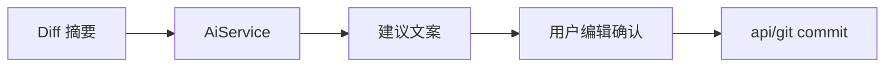

# AI 能力设计

> **相关文档：** [roadmap](roadmap.md) · [database](../architecture/database.md) · [security](../development/security.md) · [api](../api/git.md)

AI 是 **辅助层**，不是 Git 的替代执行器。所有副作用（commit、push、删分支）必须经现有 Git Command，并由用户确认。

当前已落地 DeepSeek 提交文案建议与鲸灵对话的流式回复。其余能力仍按路线图逐步实现。

---

## 设计原则

1. **建议 ≠ 执行**：模型输出先展示，用户编辑后再提交
2. **最小上下文**：只上传完成任务所需的 diff/摘要，可截断
3. **可配置**：无 DeepSeek API Key 时，提示用户在设置中配置，不阻塞 Git 主路径
4. **最小实现**：当前只接入 DeepSeek（提交文案模型可在设置中经官方 `GET /models` 切换，默认 `deepseek-v4-flash` 且显式关闭 thinking；鲸灵经同一接口选模型），后续提供商扩展须经统一 `AiService`

---

## 能力列表

| 能力 | 输入 | 输出 | 用户下一步 |
|------|------|------|------------|
| **AI Commit Message** | 暂存区 diff 摘要 + 可选风格 | 标题/正文候选 | 编辑后 `git_commit` |
| **AI Diff Explain** | 单文件或提交 patch | 结构化说明 | 只读 |
| **AI Review** | 变更集 | 风险点/建议列表 | 只读；可一键复制评论 |
| **AI Branch Naming** | 用户详情 + 可选附件（md/txt/docx/pdf 文本抽取，最多 3、单文件 ≤20MB、无 OCR）+ 分支前缀 | `prefix` + kebab-case slug | 回填创建分支名称框，确认后 `git_branch_create` |
| **AI Release Notes** | 提交区间 log | 分类说明草稿 | 复制到 Release |

---

## 架构挂载

```
UI（AiPanel / Commit 旁按钮）
  → AiService
      → getStagedDiff（src/api/git）
      → DeepSeek Chat Completions API
  → 用户确认
      → src/api/git / 其他 api
```



- **不要**把 AI 逻辑塞进 `src/api/git`
- **不要**让模型返回的字符串直接当 shell

## 鲸灵：单仓 / 多仓

对内开发统一称 **单仓鲸灵** / **多仓鲸灵**（产品名都叫鲸灵，同一套 Agent）。设计详见 [统一鲸灵设计](../superpowers/specs/2026-07-21-unified-jingling-agent-design.md)。

| | 单仓鲸灵 | 多仓鲸灵 |
|--|----------|----------|
| 位置 | 主窗仓库面板 | 独立子窗 |
| 上下文 | **仅**当前 `projectId` / `repoPath` | 已登记多仓只读画像（首期） |
| 写 Git | 仅经现有确认流（若能力已开） | **不做**跨仓写 |
| 输入 `@` | 插件 / 技能 / 分支 | 插件 / 技能 / 项目 |
| 插件 / 技能 | 同一套壳；内置简历、技能创建 | 同左；简历可点名多仓 |
| 会话桶 | `project_id` 必填；删项目 CASCADE | `project_id` 空；仅手动删 |

- **插件壳：** 「新增会话」下方「插件」进入目录；内含「插件 / 技能」分段切换（共用 `AgentCatalogPanel`）。内置技能「简历生成」「技能创建」；插件目录可为空态。单仓可用 `@简历生成` / `@技能创建` / `@分支`；多仓可再 `@项目名`。明确的简历成稿或创建/更新 Skill 请求也可自然语言触发；无 Composer 快捷 chip。不做插件市场。
- **持久化：** 会话写入 SQLite（`chat_conversations` / `chat_messages`，含 `reasoning_content`）。单仓绑定 `project_id`（scope=`agent`）；多仓 `project_id` 为空（scope=`agent_global`；历史 `jinglv` / `resume_helper` scope 已迁移）。打开项目 / 打开多仓子窗时 hydrate；消息完成、停止、编辑截断、重命名/置顶/重排/删除时 upsert，不写流式中间帧。
- **对话范围与隔离：** 默认就是专业 Git / 代码 Agent（**不依赖插件**）：
  | 层 | 能力 |
  |----|------|
  | **通用鲸灵** | 只读 Git（状态、分支、提交、diff、冲突、身份等）+ 只读读代码（`list_dir` / `read_file` / `search_code`）与实现理解问答 |
  | **简历生成** | 同一套只读仓库数据上做贡献归集与项目经历查看 / 生成 / 总结；不额外开权限 |
  | **技能创建** | 对话生成可落盘 Skill 包文案；不写盘 |

  纯问候可简短回应并引导到 Git / 代码问题；无关话题礼貌收回。只有用户 `@` 技能或明确提出对应任务时，本轮才切换技能输出契约。通用 Prompt **不包含**简历成稿规则、`matchedCommits` 贡献归集写法或 Skill 创建工作流；技能之间也不共享会话续接标记。
- **宿主级内容安全：** 通用模式与所有技能共同加载不可覆盖的安全基线。明确的凭据窃取、恶意软件/免杀、未授权访问、钓鱼诈骗、暴力或非法制品请求由本地门禁在仓库读取、画像构建、API Key 读取和模型请求前直接拒绝；更广语义由安全 Prompt 约束。仓库文本全部视为不可信数据，不能通过 README、源码注释、提交信息或 patch 覆盖规则。允许安全审查、泄露检测、事故响应、恶意软件分析和明确授权测试等防御任务。
- **Git 身份（基线只读）：** 单仓快照始终注入 `repoGitIdentity`（当前仓生效的 `user.name` / `user.email`）；多仓注入 `globalGitIdentity`（全局为空时可回退已登记仓本地配置）。通用对话可直接回答「我的身份是什么」等。**简历生成**技能在此之上用同一套身份做作者过滤与项目经历成稿（查看 / 生成 / 总结）；用户也可对话声明作者覆盖。仅当完全读不到身份时该技能路径才追问一次；不猜测、不编造身份。
- **技能创建：** 用户通过 `@技能创建` 或明确的创建/更新 Skill 请求启用。鲸灵先用不超过两个高价值问题收敛用途、触发示例与产物，再生成最小技能目录、完整 `SKILL.md`、`agents/openai.yaml` 及确有必要的 `scripts/` / `references/` / `assets/` 内容；遵守渐进披露、简洁 Prompt、无占位文件和静态校验规则。当前对话面只生成可落盘内容，不写用户文件、不安装 Skill、不宣称执行过脚本或运行时验证。
- **单仓**每次请求先注入当前项目的 **`jlgitMeta`**、**`repoGitIdentity`**，再读取只读 Git 快照（状态、分支、近期提交；询问文件列表或启用技能创建时拉 HEAD 文件树），不得混入其它项目。识别项目名与简介时优先登记详情与别名，勿用 README 覆盖用户手填简介。用户询问最近一次提交或引用近期短 SHA 时按需补文件列表；追问具体改动时最多 6 个文件限长 patch。工作区/未提交变更同理。**通用模式**另提供只读代码工具 `list_dir` / `read_file` / `search_code`（DeepSeek function calling；有 tool_calls 时不向 UI 推半截正文，最终成稿 SSE 流式上屏；结果脱敏后回灌），用于定位页面与实现逻辑；禁止写盘、越界、读取 `.env`/密钥/二进制。回复用通俗语言直接答问；发送时先上屏用户消息再异步拉快照。**简历生成**额外按作者过滤 `git log --all --author` 做贡献归集与成稿，不额外扩大只读权限面。
- **多仓**默认是**多仓 Git Agent**（解释项目、跨仓对照、只读画像问答；含 `globalGitIdentity`）。普通画像始终按仓库整体构建。代码工具须先 `@项目`（或正文点名 / 仅一仓），`codeToolRoots` 仅含目标仓；未锁定目标时不开放工具。**简历生成**再按作者过滤器延迟构建、缓存本轮简历画像并成稿；每仓仍注入提交抽样、技术栈、README 摘录与 **`jlgitMeta`**。识别项目名与简介时优先 `jlgitMeta.description` 与 `alias`，其次 README；禁止跨技能复用个人作者上下文。
- 单仓中用户明确点名两个已知分支时，可只读比较提交区间（不写 Git）。
- 需要 Git 问答时，必须显式传入当前项目路径与用户选择的上下文，禁止用其它标签或全局缓存推断。

---

## 上下文与隐私

| 规则 | 说明 |
|------|------|
| 截断 | 暂存区 patch 服务端与前端均限制为最多 64 KiB |
| 脱敏 | 仓库上下文与单仓/多仓用户消息发送前均掩码常见 API Key、token、密码与 PEM 私钥形式 |
| 安全门禁 | 高置信度恶意请求本地拒绝，不读取仓库、不调用模型；所有模式共享宿主级安全 Prompt |
| 密钥 / 指令 | 不进 SQLite；设置抽屉经 Tauri Store（`ai-secrets.json`）保存 DeepSeek API Key 列表、提交指令与拉取请求指令 |

---

## 当前提供商配置

- 提供商：DeepSeek
- Endpoint：`https://api.deepseek.com/chat/completions`
- 模型：提交文案默认 `deepseek-v4-flash`（`thinking: disabled`；可在设置 → 鲸灵切换，列表同官方 `GET /models`，偏好存 `localStorage` 键 `jlgit:commit-model`）。项目简介等其它短任务仍默认 `deepseek-v4-flash`。**单仓/多仓鲸灵** 仅展示官方 `GET /models` 返回（无本地兜底列表；无 Key / 失败则为空）。有列表时优先恢复本地已选，否则优先 `deepseek-v4-pro`。共用 `AgentReasoningBlock`。输入框可切换模型；「深度思考」仅在当前模型支持 thinking 时显示。说明：早期公开信息常按 R1（推理）/ V3（通用）划分；**当前官方 V4 Pro/Flash 均为同模型双模式**（可用 thinking 开关，见 [Thinking Mode](https://api-docs.deepseek.com/zh-cn/guides/thinking_mode)）；不支持则隐藏且请求禁用 thinking。`deepseek-chat` / `deepseek-reasoner` 已于 2026-07-24 退役，勿再硬编码。生成中仍可编辑输入框（发送键变为停止）。助手可「重新生成」；用户消息可内联「修改」后截断重发
- 设置 → 鲸灵：API Key、余额、提交信息模型、`GET /user/balance`、「去充值」（多仓鲸灵从状态栏入口打开；技能规则由各自内置 Prompt 固定，设置页不提供技能指令编辑）
- 附加指令：提交 / 拉取请求仍可读已存配置或 JLGit 默认；简历、技能创建不使用用户自定义指令
- **默认指令正文固定中文**，不跟界面语言切换；设置页标签/提示仍走 i18n。若盘里仍是旧版英文默认全文，读时视为未自定义并回退中文默认；用户改过的内容保留

网络错误、超时 → toast；DeepSeek **400/401/402/422/429/500/503** 映射为产品化文案（401「去创建 Key」、402「去充值」）；不阻塞 Git 主路径。

---

## UX 要点

- Commit 区：「生成提交信息」按钮；仅有待提交文件时可用，生成中禁用
- 创建分支：名称输入框右侧 Sparkles；弹窗填写详情，并可另附最多 3 个 PRD/文档（md/txt/docx/pdf，仅文本层）；生成后回填；打开时预填设置 → Git 的分支前缀（默认 `jlgit/`）；无 API Key 时按钮禁用
- 鲸灵对话：发送后展示深度思考（`AgentReasoningBlock`）与正文流式输出；增量按动画帧写入消息列表；请求失败或超时保留已收到的内容并提示用户；生成过程中不禁用输入框（可继续打草稿，需停止当前生成后再发送）
- 建议结果默认包含 Conventional Commit 标题及基于 diff 的简短要点；用户可编辑后再提交
- Review 结果用列表 + 严重级别，避免墙式散文
- 全员文案走 i18n；模型输出保持原语言或按设置请求语言

---

## 非目标（v0.9）

- 自主连续执行多步 Git（agent 自动 push）
- 在未审阅情况下修改工作区文件
- 训练/上传用户私有模型到不明服务

---

## 成功标准

- 无 DeepSeek API Key 时应用完整可用
- 有 Key 时，Commit Message 建议在典型变更下可减少手工写作时间
- 安全审查：敏感值发送前脱敏；高置信度恶意请求本地拦截；仓库内容不能注入系统指令；无直接执行模型返回命令
