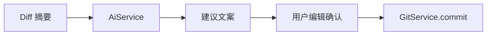

# AI 能力设计

> **相关文档：** [roadmap](roadmap.md) · [database](../architecture/database.md) · [security](../development/security.md) · [api](../api/git.md)

AI 是 **辅助层**，不是 Git 的替代执行器。所有副作用（commit、push、删分支）必须经现有 Git Command，并由用户确认。

当前已落地首个能力：**DeepSeek 提交文案建议**。其余能力仍按路线图逐步实现。

---

## 设计原则

1. **建议 ≠ 执行**：模型输出先展示，用户编辑后再提交
2. **最小上下文**：只上传完成任务所需的 diff/摘要，可截断
3. **可配置**：无 DeepSeek API Key 时，提示用户在设置中配置，不阻塞 Git 主路径
4. **最小实现**：当前只接入 DeepSeek `deepseek-chat`，后续提供商扩展须经统一 `AiService`

---

## 能力列表

| 能力 | 输入 | 输出 | 用户下一步 |
|------|------|------|------------|
| **AI Commit Message** | 暂存区 diff 摘要 + 可选风格 | 标题/正文候选 | 编辑后 `git_commit` |
| **AI Diff Explain** | 单文件或提交 patch | 结构化说明 | 只读 |
| **AI Review** | 变更集 | 风险点/建议列表 | 只读；可一键复制评论 |
| **AI Branch Naming** | 变更摘要 / issue 标题 | 分支名候选 | 确认后 `git_branch_create` |
| **AI Release Notes** | 提交区间 log | 分类说明草稿 | 复制到 Release |

---

## 架构挂载

```
UI（AiPanel / Commit 旁按钮）
  → AiService
      → GitService.getStagedDiff
      → DeepSeek Chat Completions API
  → 用户确认
      → GitService / 其他 Service
```



- **不要**把 AI 逻辑塞进 `gitService`
- **不要**让模型返回的字符串直接当 shell

---

## 上下文与隐私

| 规则 | 说明 |
|------|------|
| 截断 | 暂存区 patch 服务端与前端均限制为最多 64 KiB |
| 脱敏 | 发送前掩码常见 API Key、token、密码与 PEM 私钥形式 |
| 密钥 / 指令 | 不进 SQLite；设置抽屉经 Tauri Store（`ai-secrets.json`）保存 DeepSeek API Key 列表、提交指令与拉取请求指令 |

---

## 当前提供商配置

- 提供商：DeepSeek
- Endpoint：`https://api.deepseek.com/chat/completions`
- 模型：`deepseek-chat`
- 设置项：用户可创建多个 `DeepSeek API Key`（名称、Key、创建日期）；同一时刻仅允许一个 Key 启用，启用新 Key 会自动禁用其它 Key；删除需二次确认
- 附加指令：用户可分别填写并保存「提交指令」「拉取请求指令」；前者会附加到提交文案请求，后者保留给后续 PR 文案生成

网络错误、401、超时 → toast；不阻塞 Git 主路径。

---

## UX 要点

- Commit 区：「生成提交信息」按钮；仅有待提交文件时可用，生成中禁用
- 建议结果默认包含 Conventional Commit 标题及基于 diff 的简短要点；用户可编辑后再提交
- Review 结果用列表 + 严重级别，避免墙式散文
- 全员文案走 i18n；模型输出保持原语言或按设置请求语言

---

## 非目标（v0.9）

- 自主连续执行多步 Git（agent 自动 push）
- 在未审阅情况下修改工作区文件
- 训练/上传用户私有模型到不明服务

---

## 成功标准

- 无 DeepSeek API Key 时应用完整可用
- 有 Key 时，Commit Message 建议在典型变更下可减少手工写作时间
- 安全审查：无密钥进日志/历史；无直接执行模型返回命令
