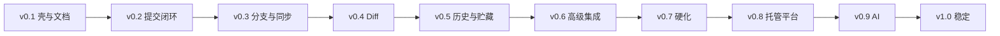

# 产品路线图

> **相关文档：** [feature-list](feature-list.md) · [releases](releases.md) · [ai](ai.md)

路线图描述 **v0.1 → v1.0** 的交付切片。日期为意向，以实际发布为准。

---

## 原则

1. 每条版本线交付**可演示的用户价值**，不只是底层重构
2. 契约（Command/API）可先行；UI 可随后
3. 不把 AI、多托管平台塞进早期关键路径
4. 安全与性能基线从 v0.2 起随功能带入，v0.7 专项加固

---

## 版本地图

---

## v0.1 — 应用壳与文档

**目标：** 可运行的桌面壳 + 完整文档宪法，统一后续实现方向。

- 文档体系（AGENTS / docs/**）
- Tauri 2 窗口与插件预置
- 前端工程基线（Vite、Tailwind、shadcn 起步）
- 目录与命名约定落地准备

**退出标准：** 新贡献者/Agent 能按文档找到分层与 Command 契约。

---

## v0.2 — 项目 + Status/Commit 闭环

**目标：** 导入仓库，查看更改，暂存并提交。

- Project CRUD + 最近/收藏
- `git_status` / stage / unstage / commit
- Dashboard + Repo Status 页
- 基础主题切换

**退出标准：** 日常「改代码 → 提交」可在 JLGit 完成。

---

## v0.3 — 分支与远程同步

- 分支列表/创建/切换/删除
- fetch / pull / push
- ahead/behind 展示
- 远程列表

**退出标准：** 与 origin 同步的主路径可用。

---

## v0.4 — Diff Viewer

- 文件级 Diff（工作区/暂存/提交）
- 截断与二进制处理
- 与 Status 选中文件联动

**退出标准：** 提交前可审阅变更内容。

---

## v0.5 — History / Graph / Tag / Stash

- 分页 log + 提交详情
- 提交图基础可视化
- Tag、Stash 管理

**退出标准：** 历史浏览与贮藏工作流可用。

---

## v0.6 — Merge / Rebase / Cherry-pick / Worktree

- 合并类操作与冲突状态
- Worktree 列表与创建
- 外开编辑器/访达入口

**退出标准：** 进阶 Git 工作流不强制回终端（冲突解决可借助外部工具）。

---

## v0.7 — 设置完善、性能与安全加固

- 设置页完整化（Git 路径、通知、语言）
- 虚拟列表与大仓库测速
- capabilities 收敛、路径测试、日志脱敏复查
- Updater 配置文档化（可选启用）

**退出标准：** 通过 [security](../development/security.md) 与 [performance](../development/performance.md) 检查清单。

---

## v0.8 — 托管平台集成（预留落地）

- GitHub 优先（Auth、打开 PR 页、克隆 URL 辅助）
- 架构预留 GitLab / Gitea / Gitee
- 不阻塞纯本地 Git 用户（可关闭）

**退出标准：** 至少一种托管平台「打开网页 / 基础集成」可用。

---

## v0.9 — AI 辅助

- Commit Message / Diff Explain / Review 最小闭环
- 提供商配置与历史
- 全部建议需用户确认后才写 Git

详见 [ai](ai.md)。

---

## v1.0 — 稳定版

- Command/API 语义冻结（破坏性变更走主版本）
- 文档与功能状态一致
- 发布通道、安装体验、已知问题清理
- 贡献流程与 CI 基线就绪

### 桌面三端（已纳入正式支持）

| 平台 | 包 / updater |
|------|----------------|
| macOS aarch64 | `.dmg` + `.app.tar.gz` → `darwin-aarch64` |
| Windows x64 | NSIS → `windows-x86_64` |
| Linux x64 | AppImage → `linux-x86_64`（参考 Ubuntu 22.04/24.04 + GNOME） |

窗口配置：`tauri.{macos,windows,linux}.conf.json`。细节见 [releases](releases.md) 与 [三端设计](../superpowers/specs/2026-07-22-official-three-platform-design.md)。

**退出标准：** 可作为日常 Git GUI 稳定使用；对外宣布 1.0。

---

## 明确延后（1.0 后候选）

| 主题 | 说明 |
|------|------|
| 完整插件系统 | 第三方扩展 |
| Cloud Sync | 同步应用数据，不同步 `.git` |
| 多窗口深度协作 | 多仓库并排高级布局 |
| 内置完整 Merge Tool | 优先外开成熟工具 |
| Linux aarch64 / deb·rpm | 首期仅 AppImage x64 |

---

## 调整策略

- 可在次要版本间微调顺序，但 **v0.2 提交闭环** 与 **v0.3 同步** 优先于 AI
- 任何提前插入的功能不得破坏分层与 Never Rules
